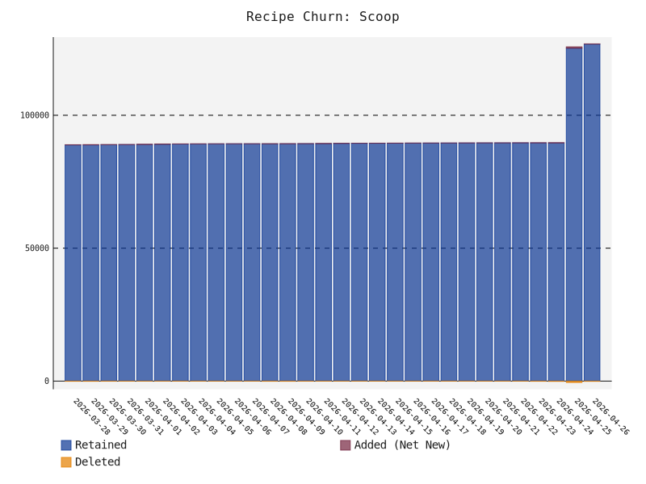
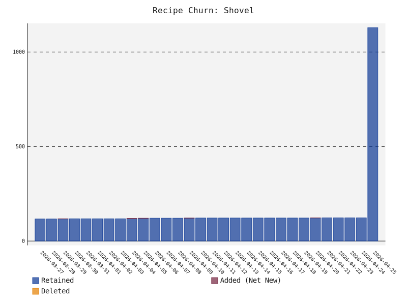

# scoop-radar
A collection of awesome resource for the scoop package manager for windows

# Build Status


# Acknowledgements
This project was heavily inspired by the original `awesome-scoop` directories maintained by [algomaniac](https://github.com/algomaniac) and [tapannallan](https://github.com/tapannallan).

# 📊 Ecosystem Health
* **Total Unique Recipes**: 4304
* **Ecosystem Auto-Update Health**: 82.57%
* **Ecosystem Reliability**: 90.3% (Sampled URL Health)
* **Official vs. Community**: 0 Official / 4304 Community
* **Bucket Ecosystem**: 209 Scoop / 2 Shovel
* **Bucket Graveyard (Stale > 1 Year)**: 🪦 68

### Ecosystem Growth (All Recipes)
<picture>
  <source media="(prefers-color-scheme: dark)" srcset="growth_all_dark.svg">
  <source media="(prefers-color-scheme: light)" srcset="growth_all_light.svg">
  
</picture>

### Scoop vs Shovel Growth
<p align="center">
  <picture>
    <source media="(prefers-color-scheme: dark)" srcset="growth_scoop_dark.svg">
    <source media="(prefers-color-scheme: light)" srcset="growth_scoop_light.svg">
    
  </picture>
  <picture>
    <source media="(prefers-color-scheme: dark)" srcset="growth_shovel_dark.svg">
    <source media="(prefers-color-scheme: light)" srcset="growth_shovel_light.svg">
    
  </picture>
</p>

# 🚀 Getting Started
To add and use any of the buckets listed below, simply run the following command in your terminal:
```powershell
scoop bucket add <bucket-name> <bucket-url>
```
For example, to add a specific bucket, find its URL from the list below and run:
```powershell
scoop bucket add my-awesome-bucket https://github.com/user/my-awesome-bucket
```
After adding the bucket, you can install any of its applications like this:
```powershell
scoop install my-awesome-bucket/<app-name>
```

# Third party buckets by popularity


## 💎 Hidden Gems
These buckets are actively maintained and feature a high percentage of **unique** applications not found in official repositories. Great for discovering niche tools!


### [wwvl/Scoop-Cursor](https://github.com/wwvl/Scoop-Cursor)
*   **Unique Recipes:** 288 (100.0% unique)
*   **Total Recipes:** 288

### [gdm257/scoop-257](https://github.com/gdm257/scoop-257)
*   **Unique Recipes:** 192 (100.0% unique)
*   **Total Recipes:** 192

### [Jadeiin/scoop](https://github.com/Jadeiin/scoop)
*   **Unique Recipes:** 190 (100.0% unique)
*   **Total Recipes:** 190

### [tomcdj71/scoop-dev-apps](https://github.com/tomcdj71/scoop-dev-apps)
*   **Unique Recipes:** 146 (100.0% unique)
*   **Total Recipes:** 146

### [ptbwu/dango](https://github.com/ptbwu/dango)
*   **Unique Recipes:** 141 (100.0% unique)
*   **Total Recipes:** 141

### [Capella87/capella-bucket](https://github.com/Capella87/capella-bucket)
*   **Unique Recipes:** 119 (100.0% unique)
*   **Total Recipes:** 119

### [tomcdj71/scoop-essential-apps](https://github.com/tomcdj71/scoop-essential-apps)
*   **Unique Recipes:** 113 (100.0% unique)
*   **Total Recipes:** 113

### [davidxuang/scoop-type](https://github.com/davidxuang/scoop-type)
*   **Unique Recipes:** 113 (100.0% unique)
*   **Total Recipes:** 113

### [huangnauh/carrot](https://github.com/huangnauh/carrot)
*   **Unique Recipes:** 113 (100.0% unique)
*   **Total Recipes:** 113

### [magicedy/scoop-bucket-m](https://github.com/magicedy/scoop-bucket-m)
*   **Unique Recipes:** 107 (100.0% unique)
*   **Total Recipes:** 107


## 🥄 Scoop Compatible Buckets
These buckets are fully compatible with Scoop (and Shovel). They contain standard JSON manifests.


* **[wwvl/Scoop-Cursor](directory/wwvl+Scoop-Cursor.md)** — 📦 288 Recipes | ⭐ Score: 1.0 | 🔄 Auto-Update: 0%

* **[gdm257/scoop-257](directory/gdm257+scoop-257.md)** — 📦 192 Recipes | ⭐ Score: 1.0 | 🔄 Auto-Update: 90%

* **[Jadeiin/scoop](directory/Jadeiin+scoop.md)** — 📦 190 Recipes | ⭐ Score: 1.0 | 🔄 Auto-Update: 99%

* **[tomcdj71/scoop-dev-apps](directory/tomcdj71+scoop-dev-apps.md)** — 📦 146 Recipes | ⭐ Score: 1.0 | 🔄 Auto-Update: 88%

* **[ptbwu/dango](directory/ptbwu+dango.md)** — 📦 141 Recipes | ⭐ Score: 1.0 | 🔄 Auto-Update: 89%

* **[Capella87/capella-bucket](directory/Capella87+capella-bucket.md)** — 📦 119 Recipes | ⭐ Score: 1.0 | 🔄 Auto-Update: 96%

* **[tomcdj71/scoop-essential-apps](directory/tomcdj71+scoop-essential-apps.md)** — 📦 113 Recipes | ⭐ Score: 1.0 | 🔄 Auto-Update: 97%

* **[davidxuang/scoop-type](directory/davidxuang+scoop-type.md)** — 📦 113 Recipes | ⭐ Score: 1.0 | 🔄 Auto-Update: 100%

* **[huangnauh/carrot](directory/huangnauh+carrot.md)** — 📦 113 Recipes | ⭐ Score: 1.0 | 🔄 Auto-Update: 99%

* **[magicedy/scoop-bucket-m](directory/magicedy+scoop-bucket-m.md)** — 📦 107 Recipes | ⭐ Score: 1.0 | 🔄 Auto-Update: 91%

* **[zeldrisho/scoop-bucket](directory/zeldrisho+scoop-bucket.md)** — 📦 106 Recipes | ⭐ Score: 1.0 | 🔄 Auto-Update: 97%

* **[cesaryuan/scoop-cesar](directory/cesaryuan+scoop-cesar.md)** — 📦 92 Recipes | ⭐ Score: 1.0 | 🔄 Auto-Update: 82%

* **[WantChane/doge_bucket](directory/WantChane+doge_bucket.md)** — 📦 88 Recipes | ⭐ Score: 1.0 | 🔄 Auto-Update: 99%

* **[lewis-yeung/scoop-bucket](directory/lewis-yeung+scoop-bucket.md)** — 📦 85 Recipes | ⭐ Score: 1.0 | 🔄 Auto-Update: 86%

* **[ZhangTianrong/scoop-bucket](directory/ZhangTianrong+scoop-bucket.md)** — 📦 82 Recipes | ⭐ Score: 1.0 | 🔄 Auto-Update: 93%

* **[Donaldduck8/malware-analysis-bucket](directory/Donaldduck8+malware-analysis-bucket.md)** — 📦 80 Recipes | ⭐ Score: 1.0 | 🔄 Auto-Update: 69%

* **[KnotUntied/scoop-knotuntied](directory/KnotUntied+scoop-knotuntied.md)** — 📦 77 Recipes | ⭐ Score: 1.0 | 🔄 Auto-Update: 82%

* **[qwerty12/scoop-alts](directory/qwerty12+scoop-alts.md)** — 📦 60 Recipes | ⭐ Score: 1.0 | 🔄 Auto-Update: 78%

* **[li-ruijie/scoop](directory/li-ruijie+scoop.md)** — 📦 59 Recipes | ⭐ Score: 1.0 | 🔄 Auto-Update: 100%

* **[mvrpl/windows-apps](directory/mvrpl+windows-apps.md)** — 📦 53 Recipes | ⭐ Score: 1.0 | 🔄 Auto-Update: 94%

* **[LaelLuo/scoop](directory/LaelLuo+scoop.md)** — 📦 52 Recipes | ⭐ Score: 1.0 | 🔄 Auto-Update: 100%

* **[apeiraco/scoop-bucket](directory/apeiraco+scoop-bucket.md)** — 📦 46 Recipes | ⭐ Score: 1.0 | 🔄 Auto-Update: 96%

* **[wanstarge/scoopx](directory/wanstarge+scoopx.md)** — 📦 42 Recipes | ⭐ Score: 1.0 | 🔄 Auto-Update: 93%

* **[niceEli/Pail](directory/niceEli+Pail.md)** — 📦 41 Recipes | ⭐ Score: 1.0 | 🔄 Auto-Update: 93%

* **[Spiraster/scoop-bucket](directory/Spiraster+scoop-bucket.md)** — 📦 41 Recipes | ⭐ Score: 1.0 | 🔄 Auto-Update: 93%

* **[Jastmaskerrr/Rojem-Scoop](directory/Jastmaskerrr+Rojem-Scoop.md)** — 📦 41 Recipes | ⭐ Score: 1.0 | 🔄 Auto-Update: 95%

* **[joaoricarte/jr-bucket](directory/joaoricarte+jr-bucket.md)** — 📦 44 Recipes | ⭐ Score: 1.0 | 🔄 Auto-Update: 95%

* **[leic4u/Scoop-Store](directory/leic4u+Scoop-Store.md)** — 📦 38 Recipes | ⭐ Score: 1.0 | 🔄 Auto-Update: 97%

* **[jbwfu/scoop-bucket](directory/jbwfu+scoop-bucket.md)** — 📦 38 Recipes | ⭐ Score: 1.0 | 🔄 Auto-Update: 97%

* **[Lutra-Fs/scoop-bucket](directory/Lutra-Fs+scoop-bucket.md)** — 📦 38 Recipes | ⭐ Score: 1.0 | 🔄 Auto-Update: 95%

* **[NSPC911/le-bucket](directory/NSPC911+le-bucket.md)** — 📦 37 Recipes | ⭐ Score: 1.0 | 🔄 Auto-Update: 97%

* **[Strappazzon/scoop](directory/Strappazzon+scoop.md)** — 📦 36 Recipes | ⭐ Score: 1.0 | 🔄 Auto-Update: 100%

* **[issaclin32/scoop-bucket](directory/issaclin32+scoop-bucket.md)** — 📦 44 Recipes | ⭐ Score: 1.0 | 🔄 Auto-Update: 68%

* **[maoyeedy/Scoop](directory/maoyeedy+Scoop.md)** — 📦 35 Recipes | ⭐ Score: 1.0 | 🔄 Auto-Update: 94%

* **[raisercostin/raiser-scoop-bucket](directory/raisercostin+raiser-scoop-bucket.md)** — 📦 34 Recipes | ⭐ Score: 1.0 | 🔄 Auto-Update: 76%

* **[MagicalDrizzle/scoop-personal](directory/MagicalDrizzle+scoop-personal.md)** — 📦 33 Recipes | ⭐ Score: 1.0 | 🔄 Auto-Update: 79%

* **[ppyv/scoop-jp-fonts](directory/ppyv+scoop-jp-fonts.md)** — 📦 33 Recipes | ⭐ Score: 1.0 | 🔄 Auto-Update: 100%

* **[mslxl/ScoopIt](directory/mslxl+ScoopIt.md)** — 📦 36 Recipes | ⭐ Score: 1.0 | 🔄 Auto-Update: 92%

* **[jat001/scoop-ox](directory/jat001+scoop-ox.md)** — 📦 38 Recipes | ⭐ Score: 1.0 | 🔄 Auto-Update: 100%

* **[Bergbok/Scoop-Bucket](directory/Bergbok+Scoop-Bucket.md)** — 📦 28 Recipes | ⭐ Score: 1.0 | 🔄 Auto-Update: 68%

* **[amano41/scoop-bucket](directory/amano41+scoop-bucket.md)** — 📦 27 Recipes | ⭐ Score: 1.0 | 🔄 Auto-Update: 96%

* **[notPlancha/bucket](directory/notPlancha+bucket.md)** — 📦 29 Recipes | ⭐ Score: 1.0 | 🔄 Auto-Update: 100%

* **[yurical/scoop-mint](directory/yurical+scoop-mint.md)** — 📦 29 Recipes | ⭐ Score: 1.0 | 🔄 Auto-Update: 97%

* **[Hayxi/Soap](directory/Hayxi+Soap.md)** — 📦 24 Recipes | ⭐ Score: 1.0 | 🔄 Auto-Update: 96%

* **[jonisb/Misc-scoops](directory/jonisb+Misc-scoops.md)** — 📦 23 Recipes | ⭐ Score: 1.0 | 🔄 Auto-Update: 100%

* **[filip2cz/scoop-retro](directory/filip2cz+scoop-retro.md)** — 📦 47 Recipes | ⭐ Score: 1.0 | 🔄 Auto-Update: 2%

* **[KO6FCH/scoop-ham](directory/KO6FCH+scoop-ham.md)** — 📦 20 Recipes | ⭐ Score: 1.0 | 🔄 Auto-Update: 100%

* **[bodrick/scoop-bucket](directory/bodrick+scoop-bucket.md)** — 📦 20 Recipes | ⭐ Score: 1.0 | 🔄 Auto-Update: 100%

* **[Dott-rus/apps](directory/Dott-rus+apps.md)** — 📦 19 Recipes | ⭐ Score: 1.0 | 🔄 Auto-Update: 100%

* **[phnthnhnm/Scoop](directory/phnthnhnm+Scoop.md)** — 📦 19 Recipes | ⭐ Score: 1.0 | 🔄 Auto-Update: 100%

* **[plutotree/scoop-bucket](directory/plutotree+scoop-bucket.md)** — 📦 18 Recipes | ⭐ Score: 1.0 | 🔄 Auto-Update: 100%

* **[danalec/scoop-alts](directory/danalec+scoop-alts.md)** — 📦 18 Recipes | ⭐ Score: 1.0 | 🔄 Auto-Update: 89%

* **[ltguillaume/schep](directory/ltguillaume+schep.md)** — 📦 18 Recipes | ⭐ Score: 1.0 | 🔄 Auto-Update: 100%

* **[MoonWX/scoop_bucket](directory/MoonWX+scoop_bucket.md)** — 📦 17 Recipes | ⭐ Score: 1.0 | 🔄 Auto-Update: 100%

* **[tkit1994/scoop_bucket](directory/tkit1994+scoop_bucket.md)** — 📦 16 Recipes | ⭐ Score: 1.0 | 🔄 Auto-Update: 100%

* **[Snowflyt/snowforge](directory/Snowflyt+snowforge.md)** — 📦 15 Recipes | ⭐ Score: 1.0 | 🔄 Auto-Update: 93%

* **[kltk/scoop-bucket](directory/kltk+scoop-bucket.md)** — 📦 15 Recipes | ⭐ Score: 1.0 | 🔄 Auto-Update: 100%

* **[haomingz/scoop-bucket](directory/haomingz+scoop-bucket.md)** — 📦 14 Recipes | ⭐ Score: 1.0 | 🔄 Auto-Update: 100%

* **[kanami09/Scoop-xPack](directory/kanami09+Scoop-xPack.md)** — 📦 14 Recipes | ⭐ Score: 1.0 | 🔄 Auto-Update: 57%

* **[santarl/scoop_bucket](directory/santarl+scoop_bucket.md)** — 📦 14 Recipes | ⭐ Score: 1.0 | 🔄 Auto-Update: 86%

* **[ddavness/scoop-roblox](directory/ddavness+scoop-roblox.md)** — 📦 12 Recipes | ⭐ Score: 1.0 | 🔄 Auto-Update: 100%

* **[WenSimEHRP/OpenTTD-bucket](directory/WenSimEHRP+OpenTTD-bucket.md)** — 📦 12 Recipes | ⭐ Score: 1.0 | 🔄 Auto-Update: 75%

* **[baaamn/Scoopercalifragilisticexpialidocious](directory/baaamn+Scoopercalifragilisticexpialidocious.md)** — 📦 12 Recipes | ⭐ Score: 1.0 | 🔄 Auto-Update: 100%

* **[swxfe/miscbucket](directory/swxfe+miscbucket.md)** — 📦 11 Recipes | ⭐ Score: 1.0 | 🔄 Auto-Update: 100%

* **[nostorg/scoop-nostr](directory/nostorg+scoop-nostr.md)** — 📦 10 Recipes | ⭐ Score: 1.0 | 🔄 Auto-Update: 100%

* **[pierreteam/scoop-js-engine](directory/pierreteam+scoop-js-engine.md)** — 📦 10 Recipes | ⭐ Score: 1.0 | 🔄 Auto-Update: 100%

* **[Vodes/Bucket](directory/Vodes+Bucket.md)** — 📦 9 Recipes | ⭐ Score: 1.0 | 🔄 Auto-Update: 100%

* **[narnaud/scoop-bucket](directory/narnaud+scoop-bucket.md)** — 📦 9 Recipes | ⭐ Score: 1.0 | 🔄 Auto-Update: 100%

* **[guitarrapc/scoop-bucket](directory/guitarrapc+scoop-bucket.md)** — 📦 12 Recipes | ⭐ Score: 1.0 | 🔄 Auto-Update: 100%

* **[NECOtype/dip](directory/NECOtype+dip.md)** — 📦 12 Recipes | ⭐ Score: 1.0 | 🔄 Auto-Update: 100%

* **[yi-Xu-0100/scoop-bucket](directory/yi-Xu-0100+scoop-bucket.md)** — 📦 10 Recipes | ⭐ Score: 1.0 | 🔄 Auto-Update: 90%

* **[dyuu7/docket](directory/dyuu7+docket.md)** — 📦 10 Recipes | ⭐ Score: 1.0 | 🔄 Auto-Update: 80%

* **[Bennett-Yang/benckets](directory/Bennett-Yang+benckets.md)** — 📦 7 Recipes | ⭐ Score: 1.0 | 🔄 Auto-Update: 100%

* **[lkhrs/eve-tools](directory/lkhrs+eve-tools.md)** — 📦 7 Recipes | ⭐ Score: 1.0 | 🔄 Auto-Update: 100%

* **[felixmaker/scoop-felixmaker](directory/felixmaker+scoop-felixmaker.md)** — 📦 9 Recipes | ⭐ Score: 1.0 | 🔄 Auto-Update: 100%

* **[robinovitch61/scoop-bucket](directory/robinovitch61+scoop-bucket.md)** — 📦 6 Recipes | ⭐ Score: 1.0 | 🔄 Auto-Update: 0%

* **[schmitzCatz/awesome-scoop-bucket](directory/schmitzCatz+awesome-scoop-bucket.md)** — 📦 6 Recipes | ⭐ Score: 1.0 | 🔄 Auto-Update: 100%

* **[tree-s/unity3d](directory/tree-s+unity3d.md)** — 📦 8 Recipes | ⭐ Score: 1.0 | 🔄 Auto-Update: 100%

* **[go-feature-flag/scoop](directory/go-feature-flag+scoop.md)** — 📦 5 Recipes | ⭐ Score: 1.0 | 🔄 Auto-Update: 0%

* **[0x0003/0x0003-s-bucket](directory/0x0003+0x0003-s-bucket.md)** — 📦 5 Recipes | ⭐ Score: 1.0 | 🔄 Auto-Update: 100%

* **[aliesbelik/astro](directory/aliesbelik+astro.md)** — 📦 5 Recipes | ⭐ Score: 1.0 | 🔄 Auto-Update: 100%

* **[amreus/bucket](directory/amreus+bucket.md)** — 📦 12 Recipes | ⭐ Score: 1.0 | 🔄 Auto-Update: 75%

* **[coatl-dev/scoop-coatl-dev](directory/coatl-dev+scoop-coatl-dev.md)** — 📦 7 Recipes | ⭐ Score: 1.0 | 🔄 Auto-Update: 100%

* **[gitfool/scoop-vpinball](directory/gitfool+scoop-vpinball.md)** — 📦 7 Recipes | ⭐ Score: 1.0 | 🔄 Auto-Update: 100%

* **[Velgus/Scoop-Velgus](directory/Velgus+Scoop-Velgus.md)** — 📦 6 Recipes | ⭐ Score: 1.0 | 🔄 Auto-Update: 100%

* **[arrow2nd/scoop-bucket](directory/arrow2nd+scoop-bucket.md)** — 📦 6 Recipes | ⭐ Score: 1.0 | 🔄 Auto-Update: 0%

* **[emotion3459/Bucket](directory/emotion3459+Bucket.md)** — 📦 4 Recipes | ⭐ Score: 1.0 | 🔄 Auto-Update: 100%

* **[kaweezle/scoop-bucket](directory/kaweezle+scoop-bucket.md)** — 📦 4 Recipes | ⭐ Score: 1.0 | 🔄 Auto-Update: 0%

* **[Koalhack/SCrispyBucket](directory/Koalhack+SCrispyBucket.md)** — 📦 7 Recipes | ⭐ Score: 1.0 | 🔄 Auto-Update: 71%

* **[filip2cz/scoop-installers](directory/filip2cz+scoop-installers.md)** — 📦 4 Recipes | ⭐ Score: 1.0 | 🔄 Auto-Update: 50%

* **[Ziyph/Scoop](directory/Ziyph+Scoop.md)** — 📦 3 Recipes | ⭐ Score: 1.0 | 🔄 Auto-Update: 100%

* **[mitoteam/scoop-bucket](directory/mitoteam+scoop-bucket.md)** — 📦 3 Recipes | ⭐ Score: 1.0 | 🔄 Auto-Update: 100%

* **[somaz94/scoop-bucket](directory/somaz94+scoop-bucket.md)** — 📦 3 Recipes | ⭐ Score: 1.0 | 🔄 Auto-Update: 0%

* **[peterrichards-lr/scoop-bucket](directory/peterrichards-lr+scoop-bucket.md)** — 📦 3 Recipes | ⭐ Score: 1.0 | 🔄 Auto-Update: 100%

* **[indra87g/awesome-indonesia-dev](directory/indra87g+awesome-indonesia-dev.md)** — 📦 3 Recipes | ⭐ Score: 1.0 | 🔄 Auto-Update: 100%

* **[fredjoseph/scoop-bucket](directory/fredjoseph+scoop-bucket.md)** — 📦 8 Recipes | ⭐ Score: 1.0 | 🔄 Auto-Update: 88%

* **[ShihaoShenDev/ScoopBucket](directory/ShihaoShenDev+ScoopBucket.md)** — 📦 4 Recipes | ⭐ Score: 1.0 | 🔄 Auto-Update: 100%

* **[jbangdev/scoop-bucket](directory/jbangdev+scoop-bucket.md)** — 📦 2 Recipes | ⭐ Score: 1.0 | 🔄 Auto-Update: 100%

* **[ba230t/scoop-bucket](directory/ba230t+scoop-bucket.md)** — 📦 2 Recipes | ⭐ Score: 1.0 | 🔄 Auto-Update: 100%

* **[tree-s/arc](directory/tree-s+arc.md)** — 📦 2 Recipes | ⭐ Score: 1.0 | 🔄 Auto-Update: 100%

* **[tree-s/windowsSDK](directory/tree-s+windowsSDK.md)** — 📦 2 Recipes | ⭐ Score: 1.0 | 🔄 Auto-Update: 100%

* **[perryhq/perryhq-scoop](directory/perryhq+perryhq-scoop.md)** — 📦 2 Recipes | ⭐ Score: 1.0 | 🔄 Auto-Update: 100%

* **[cppbear/scoop-cppbear](directory/cppbear+scoop-cppbear.md)** — 📦 2 Recipes | ⭐ Score: 1.0 | 🔄 Auto-Update: 100%

* **[ClaudiaHeart/scoop-bucket-claudiaheart](directory/ClaudiaHeart+scoop-bucket-claudiaheart.md)** — 📦 6 Recipes | ⭐ Score: 1.0 | 🔄 Auto-Update: 83%

* **[OmyDaGreat/MaleficBucket](directory/OmyDaGreat+MaleficBucket.md)** — 📦 2 Recipes | ⭐ Score: 1.0 | 🔄 Auto-Update: 100%

* **[auth0/scoop-auth0-cli](directory/auth0+scoop-auth0-cli.md)** — 📦 1 Recipes | ⭐ Score: 1.0 | 🔄 Auto-Update: 0%

* **[psmux/scoop-psmux](directory/psmux+scoop-psmux.md)** — 📦 1 Recipes | ⭐ Score: 1.0 | 🔄 Auto-Update: 100%

* **[rustfs/scoop-bucket](directory/rustfs+scoop-bucket.md)** — 📦 1 Recipes | ⭐ Score: 1.0 | 🔄 Auto-Update: 100%

* **[tree-s/virtualbox](directory/tree-s+virtualbox.md)** — 📦 1 Recipes | ⭐ Score: 1.0 | 🔄 Auto-Update: 100%

* **[kdash-rs/scoop-kdash](directory/kdash-rs+scoop-kdash.md)** — 📦 1 Recipes | ⭐ Score: 1.0 | 🔄 Auto-Update: 100%

* **[ipatalas/scoop-bucket](directory/ipatalas+scoop-bucket.md)** — 📦 1 Recipes | ⭐ Score: 1.0 | 🔄 Auto-Update: 100%

* **[kubri/scoop-bucket](directory/kubri+scoop-bucket.md)** — 📦 1 Recipes | ⭐ Score: 1.0 | 🔄 Auto-Update: 0%

* **[mohitmishra786/scoop-bucket](directory/mohitmishra786+scoop-bucket.md)** — 📦 1 Recipes | ⭐ Score: 1.0 | 🔄 Auto-Update: 100%

* **[Nimblesite/scoop-bucket](directory/Nimblesite+scoop-bucket.md)** — 📦 1 Recipes | ⭐ Score: 1.0 | 🔄 Auto-Update: 100%

* **[systempromptio/scoop-bucket](directory/systempromptio+scoop-bucket.md)** — 📦 1 Recipes | ⭐ Score: 1.0 | 🔄 Auto-Update: 100%

* **[terraform-docs/scoop-bucket](directory/terraform-docs+scoop-bucket.md)** — 📦 1 Recipes | ⭐ Score: 1.0 | 🔄 Auto-Update: 0%

* **[henrygd/beszel-scoops](directory/henrygd+beszel-scoops.md)** — 📦 1 Recipes | ⭐ Score: 1.0 | 🔄 Auto-Update: 0%

* **[xhorntail/xho-scoops](directory/xhorntail+xho-scoops.md)** — 📦 1 Recipes | ⭐ Score: 1.0 | 🔄 Auto-Update: 100%

* **[stefanlogue/scoops](directory/stefanlogue+scoops.md)** — 📦 1 Recipes | ⭐ Score: 1.0 | 🔄 Auto-Update: 0%

* **[PranavU-Coder/scoop-bucket](directory/PranavU-Coder+scoop-bucket.md)** — 📦 1 Recipes | ⭐ Score: 1.0 | 🔄 Auto-Update: 100%

* **[shoehorn-dev/scoop-bucket](directory/shoehorn-dev+scoop-bucket.md)** — 📦 1 Recipes | ⭐ Score: 1.0 | 🔄 Auto-Update: 100%

* **[yazeed/scoop-bucket-proc](directory/yazeed+scoop-bucket-proc.md)** — 📦 1 Recipes | ⭐ Score: 1.0 | 🔄 Auto-Update: 100%

* **[mlm-games/buckets-scoop](directory/mlm-games+buckets-scoop.md)** — 📦 2 Recipes | ⭐ Score: 1.0 | 🔄 Auto-Update: 100%

* **[caffeine-addictt/scoop-bucket](directory/caffeine-addictt+scoop-bucket.md)** — 📦 1 Recipes | ⭐ Score: 1.0 | 🔄 Auto-Update: 0%

* **[Gasoid/baker-scoop](directory/Gasoid+baker-scoop.md)** — 📦 1 Recipes | ⭐ Score: 1.0 | 🔄 Auto-Update: 100%

* **[tree-s/GBStudio](directory/tree-s+GBStudio.md)** — 📦 1 Recipes | ⭐ Score: 1.0 | 🔄 Auto-Update: 100%

* **[DoveBoy/Scoop-Bucket](directory/DoveBoy+Scoop-Bucket.md)** — 📦 3 Recipes | ⭐ Score: 1.0 | 🔄 Auto-Update: 100%

* **[sohamw03/Scoop-Bucket](directory/sohamw03+Scoop-Bucket.md)** — 📦 1 Recipes | ⭐ Score: 1.0 | 🔄 Auto-Update: 100%

* **[ypurpl/bucket](directory/ypurpl+bucket.md)** — 📦 2 Recipes | ⭐ Score: 1.0 | 🔄 Auto-Update: 50%

* **[meenzen/scoop](directory/meenzen+scoop.md)** — 📦 1 Recipes | ⭐ Score: 1.0 | 🔄 Auto-Update: 100%

* **[tree-s/mIRC](directory/tree-s+mIRC.md)** — 📦 1 Recipes | ⭐ Score: 1.0 | 🔄 Auto-Update: 100%

* **[nginx/scoop-bucket](directory/nginx+scoop-bucket.md)** — 📦 1 Recipes | ⭐ Score: 1.0 | 🔄 Auto-Update: 0%

* **[dh6wk/ScoopRepo](directory/dh6wk+ScoopRepo.md)** — 📦 5 Recipes | ⭐ Score: 1.0 | 🔄 Auto-Update: 80%

* **[Overimagine1/Poop](directory/Overimagine1+Poop.md)** — 📦 2 Recipes | ⭐ Score: 1.0 | 🔄 Auto-Update: 100%

* **[jazzwang/scoop-bucket](directory/jazzwang+scoop-bucket.md)** — 📦 9 Recipes | ⭐ Score: 1.0 | 🔄 Auto-Update: 0%

* **[SunsetMkt/scoop-aliceincradle](directory/SunsetMkt+scoop-aliceincradle.md)** — 📦 1 Recipes | ⭐ Score: 1.0 | 🔄 Auto-Update: 100%

* **[QZLin/winscp-trans](directory/QZLin+winscp-trans.md)** — 📦 1 Recipes | ⭐ Score: 1.0 | 🔄 Auto-Update: 0%

* **[Absolucy/scoop-lucy](directory/Absolucy+scoop-lucy.md)** — 📦 4 Recipes | ⭐ Score: 1.0 | 🔄 Auto-Update: 100%

* **[Qile0317/compbio-scoop-bucket](directory/Qile0317+compbio-scoop-bucket.md)** — 📦 1 Recipes | ⭐ Score: 1.0 | 🔄 Auto-Update: 100%

* **[Excalian/scoop](directory/Excalian+scoop.md)** — 📦 1 Recipes | ⭐ Score: 1.0 | 🔄 Auto-Update: 100%

* **[luke-beep/azrael-scoop](directory/luke-beep+azrael-scoop.md)** — 📦 4 Recipes | ⭐ Score: 1.0 | 🔄 Auto-Update: 0%

* **[Cooperter/scoop-bucket](directory/Cooperter+scoop-bucket.md)** — 📦 4 Recipes | ⭐ Score: 1.0 | 🔄 Auto-Update: 75%

* **[wind-mask/scoop-bucket-repository](directory/wind-mask+scoop-bucket-repository.md)** — 📦 7 Recipes | ⭐ Score: 1.0 | 🔄 Auto-Update: 86%

* **[Desdaemon/scoop-repo](directory/Desdaemon+scoop-repo.md)** — 📦 3 Recipes | ⭐ Score: 1.0 | 🔄 Auto-Update: 100%

* **[rnine/scoop-duobolt](directory/rnine+scoop-duobolt.md)** — 📦 1 Recipes | ⭐ Score: 1.0 | 🔄 Auto-Update: 100%

* **[MichaelHaussmann/scoop-play](directory/MichaelHaussmann+scoop-play.md)** — 📦 2 Recipes | ⭐ Score: 1.0 | 🔄 Auto-Update: 0%

* **[kevinboss/maple](directory/kevinboss+maple.md)** — 📦 3 Recipes | ⭐ Score: 1.0 | 🔄 Auto-Update: 100%

* **[phanirithvij/scop](directory/phanirithvij+scop.md)** — 📦 12 Recipes | ⭐ Score: 1.0 | 🔄 Auto-Update: 75%

* **[SKalt/scoop-git-cc](directory/SKalt+scoop-git-cc.md)** — 📦 1 Recipes | ⭐ Score: 1.0 | 🔄 Auto-Update: 0%

* **[heroku-miraheze/scoop-bucket](directory/heroku-miraheze+scoop-bucket.md)** — 📦 3 Recipes | ⭐ Score: 1.0 | 🔄 Auto-Update: 67%

* **[tree-s/progressquest](directory/tree-s+progressquest.md)** — 📦 1 Recipes | ⭐ Score: 1.0 | 🔄 Auto-Update: 0%

* **[upyun/carrot](directory/upyun+carrot.md)** — 📦 2 Recipes | ⭐ Score: 1.0 | 🔄 Auto-Update: 100%

* **[darkliquid/bucket](directory/darkliquid+bucket.md)** — 📦 7 Recipes | ⭐ Score: 1.0 | 🔄 Auto-Update: 86%

* **[Jenway/scoop](directory/Jenway+scoop.md)** — 📦 8 Recipes | ⭐ Score: 1.0 | 🔄 Auto-Update: 100%

* **[Daniele-rolli/Beaver-Bucket](directory/Daniele-rolli+Beaver-Bucket.md)** — 📦 2 Recipes | ⭐ Score: 1.0 | 🔄 Auto-Update: 100%

* **[GunMoe/scoop-bucket](directory/GunMoe+scoop-bucket.md)** — 📦 13 Recipes | ⭐ Score: 1.0 | 🔄 Auto-Update: 69%

* **[Dumpinground/openra-mods](directory/Dumpinground+openra-mods.md)** — 📦 2 Recipes | ⭐ Score: 1.0 | 🔄 Auto-Update: 100%

* **[DelineaXPM/scoop-bucket](directory/DelineaXPM+scoop-bucket.md)** — 📦 1 Recipes | ⭐ Score: 1.0 | 🔄 Auto-Update: 0%

* **[Nriver/Scoop-Nriver](directory/Nriver+Scoop-Nriver.md)** — 📦 2 Recipes | ⭐ Score: 1.0 | 🔄 Auto-Update: 100%

* **[tree-s/shiftcrypto](directory/tree-s+shiftcrypto.md)** — 📦 1 Recipes | ⭐ Score: 1.0 | 🔄 Auto-Update: 100%

* **[sirredbeard/determined-bucket](directory/sirredbeard+determined-bucket.md)** — 📦 1 Recipes | ⭐ Score: 1.0 | 🔄 Auto-Update: 100%

* **[cOborski/chartreuse-triceratops](directory/cOborski+chartreuse-triceratops.md)** — 📦 2 Recipes | ⭐ Score: 1.0 | 🔄 Auto-Update: 100%

* **[rexlManu/scoop-bucket](directory/rexlManu+scoop-bucket.md)** — 📦 1 Recipes | ⭐ Score: 1.0 | 🔄 Auto-Update: 100%

* **[tree-s/fraps](directory/tree-s+fraps.md)** — 📦 1 Recipes | ⭐ Score: 1.0 | 🔄 Auto-Update: 100%

* **[acdzh/zpt](directory/acdzh+zpt.md)** — 📦 12 Recipes | ⭐ Score: 1.0 | 🔄 Auto-Update: 100%

* **[skellygore/scoop-bucket](directory/skellygore+scoop-bucket.md)** — 📦 9 Recipes | ⭐ Score: 1.0 | 🔄 Auto-Update: 0%

* **[foosel/scoop-bucket](directory/foosel+scoop-bucket.md)** — 📦 7 Recipes | ⭐ Score: 1.0 | 🔄 Auto-Update: 100%

* **[subchen/scoop-bucket](directory/subchen+scoop-bucket.md)** — 📦 5 Recipes | ⭐ Score: 1.0 | 🔄 Auto-Update: 100%

* **[Vechro/ryence](directory/Vechro+ryence.md)** — 📦 7 Recipes | ⭐ Score: 1.0 | 🔄 Auto-Update: 100%

* **[miketvo/scoop-miketvo](directory/miketvo+scoop-miketvo.md)** — 📦 1 Recipes | ⭐ Score: 1.0 | 🔄 Auto-Update: 100%

* **[sebagomez/scoopbucket](directory/sebagomez+scoopbucket.md)** — 📦 3 Recipes | ⭐ Score: 1.0 | 🔄 Auto-Update: 0%

* **[jihuayu/jscoop](directory/jihuayu+jscoop.md)** — 📦 8 Recipes | ⭐ Score: 1.0 | 🔄 Auto-Update: 100%

* **[gaojr/MyScoopBucket](directory/gaojr+MyScoopBucket.md)** — 📦 7 Recipes | ⭐ Score: 1.0 | 🔄 Auto-Update: 86%

* **[sveltinio/scoop-sveltin](directory/sveltinio+scoop-sveltin.md)** — 📦 1 Recipes | ⭐ Score: 1.0 | 🔄 Auto-Update: 0%

* **[celsiusnarhwal/kirigiri](directory/celsiusnarhwal+kirigiri.md)** — 📦 1 Recipes | ⭐ Score: 1.0 | 🔄 Auto-Update: 100%

* **[Skyppex/sky-bucket](directory/Skyppex+sky-bucket.md)** — 📦 2 Recipes | ⭐ Score: 1.0 | 🔄 Auto-Update: 100%

* **[comp500/scoop-comp500](directory/comp500+scoop-comp500.md)** — 📦 7 Recipes | ⭐ Score: 1.0 | 🔄 Auto-Update: 86%

* **[pvarentsov/scoop-iola](directory/pvarentsov+scoop-iola.md)** — 📦 1 Recipes | ⭐ Score: 1.0 | 🔄 Auto-Update: 100%

* **[littleli/scoop-garage](directory/littleli+scoop-garage.md)** — 📦 31 Recipes | ⭐ Score: 1.0 | 🔄 Auto-Update: 77%

* **[rkolka/scoop-manifold](directory/rkolka+scoop-manifold.md)** — 📦 9 Recipes | ⭐ Score: 1.0 | 🔄 Auto-Update: 56%

* **[flvinny/scoop-bucket](directory/flvinny+scoop-bucket.md)** — 📦 2 Recipes | ⭐ Score: 1.0 | 🔄 Auto-Update: 100%

* **[xfournet/scoop-sboot](directory/xfournet+scoop-sboot.md)** — 📦 1 Recipes | ⭐ Score: 1.0 | 🔄 Auto-Update: 100%

* **[adamrodger/scoop-bucket](directory/adamrodger+scoop-bucket.md)** — 📦 1 Recipes | ⭐ Score: 1.0 | 🔄 Auto-Update: 100%

* **[TonyZYT2000/scoop-Andromeda](directory/TonyZYT2000+scoop-Andromeda.md)** — 📦 6 Recipes | ⭐ Score: 1.0 | 🔄 Auto-Update: 83%

* **[pasoevi/more-scoops](directory/pasoevi+more-scoops.md)** — 📦 2 Recipes | ⭐ Score: 1.0 | 🔄 Auto-Update: 0%

* **[cidertool/scoop-bucket](directory/cidertool+scoop-bucket.md)** — 📦 1 Recipes | ⭐ Score: 1.0 | 🔄 Auto-Update: 0%

* **[gpailler/scoop-apps](directory/gpailler+scoop-apps.md)** — 📦 5 Recipes | ⭐ Score: 1.0 | 🔄 Auto-Update: 100%

* **[vsviridov/scoop-bucket](directory/vsviridov+scoop-bucket.md)** — 📦 1 Recipes | ⭐ Score: 1.0 | 🔄 Auto-Update: 100%

* **[Kazanami/zeus-bucket](directory/Kazanami+zeus-bucket.md)** — 📦 5 Recipes | ⭐ Score: 1.0 | 🔄 Auto-Update: 60%

* **[CALMorACT/hola_bucket](directory/CALMorACT+hola_bucket.md)** — 📦 18 Recipes | ⭐ Score: 1.0 | 🔄 Auto-Update: 83%

* **[GreatGodApollo/trough](directory/GreatGodApollo+trough.md)** — 📦 2 Recipes | ⭐ Score: 1.0 | 🔄 Auto-Update: 0%

* **[AndreasBrostrom/arma3-scoop-bucket](directory/AndreasBrostrom+arma3-scoop-bucket.md)** — 📦 1 Recipes | ⭐ Score: 1.0 | 🔄 Auto-Update: 100%

* **[jku1995/Jbucket](directory/jku1995+Jbucket.md)** — 📦 1 Recipes | ⭐ Score: 1.0 | 🔄 Auto-Update: 100%

* **[pigsflew/scoop-arbitrariae](directory/pigsflew+scoop-arbitrariae.md)** — 📦 5 Recipes | ⭐ Score: 1.0 | 🔄 Auto-Update: 100%

* **[garyng/scoop-garyng](directory/garyng+scoop-garyng.md)** — 📦 2 Recipes | ⭐ Score: 1.0 | 🔄 Auto-Update: 100%

* **[prantlf/scoop-bucket](directory/prantlf+scoop-bucket.md)** — 📦 3 Recipes | ⭐ Score: 1.0 | 🔄 Auto-Update: 0%

* **[Etsinshao/scoop-bucket](directory/Etsinshao+scoop-bucket.md)** — 📦 7 Recipes | ⭐ Score: 1.0 | 🔄 Auto-Update: 100%

* **[PorridgePi/scoop-bucket](directory/PorridgePi+scoop-bucket.md)** — 📦 3 Recipes | ⭐ Score: 1.0 | 🔄 Auto-Update: 100%

* **[Master-Hash/bucket](directory/Master-Hash+bucket.md)** — 📦 4 Recipes | ⭐ Score: 1.0 | 🔄 Auto-Update: 100%

* **[aenthill/scoop-bucket](directory/aenthill+scoop-bucket.md)** — 📦 1 Recipes | ⭐ Score: 1.0 | 🔄 Auto-Update: 0%

* **[icedream/scoop-bucket](directory/icedream+scoop-bucket.md)** — 📦 2 Recipes | ⭐ Score: 1.0 | 🔄 Auto-Update: 100%

* **[FDUZS/spoon](directory/FDUZS+spoon.md)** — 📦 42 Recipes | ⭐ Score: 1.0 | 🔄 Auto-Update: 98%

* **[TheAsuro/scoop-stuff](directory/TheAsuro+scoop-stuff.md)** — 📦 2 Recipes | ⭐ Score: 1.0 | 🔄 Auto-Update: 100%

* **[nickbudi/scoop-bucket](directory/nickbudi+scoop-bucket.md)** — 📦 30 Recipes | ⭐ Score: 1.0 | 🔄 Auto-Update: 80%

* **[earnestma/scoop-earne](directory/earnestma+scoop-earne.md)** — 📦 10 Recipes | ⭐ Score: 1.0 | 🔄 Auto-Update: 70%

* **[Mushus/scoop-bucket](directory/Mushus+scoop-bucket.md)** — 📦 3 Recipes | ⭐ Score: 1.0 | 🔄 Auto-Update: 67%

* **[tobyvin/scoop-tobyvin](directory/tobyvin+scoop-tobyvin.md)** — 📦 25 Recipes | ⭐ Score: 1.0 | 🔄 Auto-Update: 72%

* **[Harakku/harakkus-scoop-bucket](directory/Harakku+harakkus-scoop-bucket.md)** — 📦 21 Recipes | ⭐ Score: 1.0 | 🔄 Auto-Update: 86%

* **[ProfElements/EmulatorBucket](directory/ProfElements+EmulatorBucket.md)** — 📦 27 Recipes | ⭐ Score: 1.0 | 🔄 Auto-Update: 0%


## ⛏️ Shovel Specific Buckets
These buckets utilize Shovel-specific features (like native YAML manifests) or are explicitly tagged for Shovel. They may not work with standard Scoop.


### [caoli5288/scoop-bucket](https://github.com/caoli5288/scoop-bucket) (Score: 1.0 | Auto-Update: 84%)
* [bilitools.json](https://github.com/caoli5288/scoop-bucket/blob/master/bilitools.json)
* [cc-switch.json](https://github.com/caoli5288/scoop-bucket/blob/master/cc-switch.json)
* [cheatengine-chs.json](https://github.com/caoli5288/scoop-bucket/blob/master/cheatengine-chs.json)
* [csvq.json](https://github.com/caoli5288/scoop-bucket/blob/master/csvq.json)
* [datastation.json](https://github.com/caoli5288/scoop-bucket/blob/master/datastation.json)
* [downkyi.json](https://github.com/caoli5288/scoop-bucket/blob/master/downkyi.json)
* [dsq.json](https://github.com/caoli5288/scoop-bucket/blob/master/dsq.json)
* [frpc-desktop.json](https://github.com/caoli5288/scoop-bucket/blob/master/frpc-desktop.json)
* [genshin-wish-export.json](https://github.com/caoli5288/scoop-bucket/blob/master/genshin-wish-export.json)
* [golutra.json](https://github.com/caoli5288/scoop-bucket/blob/master/golutra.json)
* [maaassistantarknights.json](https://github.com/caoli5288/scoop-bucket/blob/master/maaassistantarknights.json)
* [maven38.json](https://github.com/caoli5288/scoop-bucket/blob/master/maven38.json)
* [mc-w10-version-launcher.json](https://github.com/caoli5288/scoop-bucket/blob/master/mc-w10-version-launcher.json)
* [mcaselector.json](https://github.com/caoli5288/scoop-bucket/blob/master/mcaselector.json)
* [mrrss.json](https://github.com/caoli5288/scoop-bucket/blob/master/mrrss.json)
* [networkmanager.json](https://github.com/caoli5288/scoop-bucket/blob/master/networkmanager.json)
* [pcl2-ce.json](https://github.com/caoli5288/scoop-bucket/blob/master/pcl2-ce.json)
* [picacg-qt.json](https://github.com/caoli5288/scoop-bucket/blob/master/picacg-qt.json)
* [praises.json](https://github.com/caoli5288/scoop-bucket/blob/master/praises.json)
* [realesrgan-ncnn-vulkan.json](https://github.com/caoli5288/scoop-bucket/blob/master/realesrgan-ncnn-vulkan.json)
* [rem.json](https://github.com/caoli5288/scoop-bucket/blob/master/rem.json)
* [star-rail-warp-export.json](https://github.com/caoli5288/scoop-bucket/blob/master/star-rail-warp-export.json)
* [tagstudio.json](https://github.com/caoli5288/scoop-bucket/blob/master/tagstudio.json)
* [visipics.json](https://github.com/caoli5288/scoop-bucket/blob/master/visipics.json)
* [wolfrpgeditor.json](https://github.com/caoli5288/scoop-bucket/blob/master/wolfrpgeditor.json)

### [Jeddunk/scoop-bucket](https://github.com/Jeddunk/scoop-bucket) (Score: 1.0 | Auto-Update: 90%)
* [7kaa.json](https://github.com/Jeddunk/scoop-bucket/blob/master/7kaa.json)
* [cdda-game-launcher.json](https://github.com/Jeddunk/scoop-bucket/blob/master/cdda-game-launcher.json)
* [cupscale.json](https://github.com/Jeddunk/scoop-bucket/blob/master/cupscale.json)
* [dgvoodoo.json](https://github.com/Jeddunk/scoop-bucket/blob/master/dgvoodoo.json)
* [kg-gui.json](https://github.com/Jeddunk/scoop-bucket/blob/master/kg-gui.json)
* [koalageddon.json](https://github.com/Jeddunk/scoop-bucket/blob/master/koalageddon.json)
* [qimgv-video.json](https://github.com/Jeddunk/scoop-bucket/blob/master/qimgv-video.json)
* [qimgv.json](https://github.com/Jeddunk/scoop-bucket/blob/master/qimgv.json)
* [waifu2x-ncnn-vulkan.json](https://github.com/Jeddunk/scoop-bucket/blob/master/waifu2x-ncnn-vulkan.json)
* [ygo-omega.json](https://github.com/Jeddunk/scoop-bucket/blob/master/ygo-omega.json)


## 📦 All Known Buckets
A combined list of every bucket discovered in the ecosystem.


* **[wwvl/Scoop-Cursor](directory/wwvl+Scoop-Cursor.md)** — 📦 288 Recipes | ⭐ Score: 1.0 | 🔄 Auto-Update: 0%

* **[gdm257/scoop-257](directory/gdm257+scoop-257.md)** — 📦 192 Recipes | ⭐ Score: 1.0 | 🔄 Auto-Update: 90%

* **[Jadeiin/scoop](directory/Jadeiin+scoop.md)** — 📦 190 Recipes | ⭐ Score: 1.0 | 🔄 Auto-Update: 99%

* **[tomcdj71/scoop-dev-apps](directory/tomcdj71+scoop-dev-apps.md)** — 📦 146 Recipes | ⭐ Score: 1.0 | 🔄 Auto-Update: 88%

* **[ptbwu/dango](directory/ptbwu+dango.md)** — 📦 141 Recipes | ⭐ Score: 1.0 | 🔄 Auto-Update: 89%

* **[Capella87/capella-bucket](directory/Capella87+capella-bucket.md)** — 📦 119 Recipes | ⭐ Score: 1.0 | 🔄 Auto-Update: 96%

* **[tomcdj71/scoop-essential-apps](directory/tomcdj71+scoop-essential-apps.md)** — 📦 113 Recipes | ⭐ Score: 1.0 | 🔄 Auto-Update: 97%

* **[davidxuang/scoop-type](directory/davidxuang+scoop-type.md)** — 📦 113 Recipes | ⭐ Score: 1.0 | 🔄 Auto-Update: 100%

* **[huangnauh/carrot](directory/huangnauh+carrot.md)** — 📦 113 Recipes | ⭐ Score: 1.0 | 🔄 Auto-Update: 99%

* **[magicedy/scoop-bucket-m](directory/magicedy+scoop-bucket-m.md)** — 📦 107 Recipes | ⭐ Score: 1.0 | 🔄 Auto-Update: 91%

* **[zeldrisho/scoop-bucket](directory/zeldrisho+scoop-bucket.md)** — 📦 106 Recipes | ⭐ Score: 1.0 | 🔄 Auto-Update: 97%

* **[cesaryuan/scoop-cesar](directory/cesaryuan+scoop-cesar.md)** — 📦 92 Recipes | ⭐ Score: 1.0 | 🔄 Auto-Update: 82%

* **[WantChane/doge_bucket](directory/WantChane+doge_bucket.md)** — 📦 88 Recipes | ⭐ Score: 1.0 | 🔄 Auto-Update: 99%

* **[lewis-yeung/scoop-bucket](directory/lewis-yeung+scoop-bucket.md)** — 📦 85 Recipes | ⭐ Score: 1.0 | 🔄 Auto-Update: 86%

* **[ZhangTianrong/scoop-bucket](directory/ZhangTianrong+scoop-bucket.md)** — 📦 82 Recipes | ⭐ Score: 1.0 | 🔄 Auto-Update: 93%

* **[Donaldduck8/malware-analysis-bucket](directory/Donaldduck8+malware-analysis-bucket.md)** — 📦 80 Recipes | ⭐ Score: 1.0 | 🔄 Auto-Update: 69%

* **[KnotUntied/scoop-knotuntied](directory/KnotUntied+scoop-knotuntied.md)** — 📦 77 Recipes | ⭐ Score: 1.0 | 🔄 Auto-Update: 82%

* **[qwerty12/scoop-alts](directory/qwerty12+scoop-alts.md)** — 📦 60 Recipes | ⭐ Score: 1.0 | 🔄 Auto-Update: 78%

* **[li-ruijie/scoop](directory/li-ruijie+scoop.md)** — 📦 59 Recipes | ⭐ Score: 1.0 | 🔄 Auto-Update: 100%

* **[mvrpl/windows-apps](directory/mvrpl+windows-apps.md)** — 📦 53 Recipes | ⭐ Score: 1.0 | 🔄 Auto-Update: 94%

* **[LaelLuo/scoop](directory/LaelLuo+scoop.md)** — 📦 52 Recipes | ⭐ Score: 1.0 | 🔄 Auto-Update: 100%

* **[apeiraco/scoop-bucket](directory/apeiraco+scoop-bucket.md)** — 📦 46 Recipes | ⭐ Score: 1.0 | 🔄 Auto-Update: 96%

* **[wanstarge/scoopx](directory/wanstarge+scoopx.md)** — 📦 42 Recipes | ⭐ Score: 1.0 | 🔄 Auto-Update: 93%

* **[niceEli/Pail](directory/niceEli+Pail.md)** — 📦 41 Recipes | ⭐ Score: 1.0 | 🔄 Auto-Update: 93%

* **[Spiraster/scoop-bucket](directory/Spiraster+scoop-bucket.md)** — 📦 41 Recipes | ⭐ Score: 1.0 | 🔄 Auto-Update: 93%

* **[Jastmaskerrr/Rojem-Scoop](directory/Jastmaskerrr+Rojem-Scoop.md)** — 📦 41 Recipes | ⭐ Score: 1.0 | 🔄 Auto-Update: 95%

* **[joaoricarte/jr-bucket](directory/joaoricarte+jr-bucket.md)** — 📦 44 Recipes | ⭐ Score: 1.0 | 🔄 Auto-Update: 95%

* **[leic4u/Scoop-Store](directory/leic4u+Scoop-Store.md)** — 📦 38 Recipes | ⭐ Score: 1.0 | 🔄 Auto-Update: 97%

* **[jbwfu/scoop-bucket](directory/jbwfu+scoop-bucket.md)** — 📦 38 Recipes | ⭐ Score: 1.0 | 🔄 Auto-Update: 97%

* **[Lutra-Fs/scoop-bucket](directory/Lutra-Fs+scoop-bucket.md)** — 📦 38 Recipes | ⭐ Score: 1.0 | 🔄 Auto-Update: 95%

* **[NSPC911/le-bucket](directory/NSPC911+le-bucket.md)** — 📦 37 Recipes | ⭐ Score: 1.0 | 🔄 Auto-Update: 97%

* **[Strappazzon/scoop](directory/Strappazzon+scoop.md)** — 📦 36 Recipes | ⭐ Score: 1.0 | 🔄 Auto-Update: 100%

* **[issaclin32/scoop-bucket](directory/issaclin32+scoop-bucket.md)** — 📦 44 Recipes | ⭐ Score: 1.0 | 🔄 Auto-Update: 68%

* **[maoyeedy/Scoop](directory/maoyeedy+Scoop.md)** — 📦 35 Recipes | ⭐ Score: 1.0 | 🔄 Auto-Update: 94%

* **[raisercostin/raiser-scoop-bucket](directory/raisercostin+raiser-scoop-bucket.md)** — 📦 34 Recipes | ⭐ Score: 1.0 | 🔄 Auto-Update: 76%

* **[MagicalDrizzle/scoop-personal](directory/MagicalDrizzle+scoop-personal.md)** — 📦 33 Recipes | ⭐ Score: 1.0 | 🔄 Auto-Update: 79%

* **[ppyv/scoop-jp-fonts](directory/ppyv+scoop-jp-fonts.md)** — 📦 33 Recipes | ⭐ Score: 1.0 | 🔄 Auto-Update: 100%

* **[mslxl/ScoopIt](directory/mslxl+ScoopIt.md)** — 📦 36 Recipes | ⭐ Score: 1.0 | 🔄 Auto-Update: 92%

* **[jat001/scoop-ox](directory/jat001+scoop-ox.md)** — 📦 38 Recipes | ⭐ Score: 1.0 | 🔄 Auto-Update: 100%

* **[Bergbok/Scoop-Bucket](directory/Bergbok+Scoop-Bucket.md)** — 📦 28 Recipes | ⭐ Score: 1.0 | 🔄 Auto-Update: 68%

* **[amano41/scoop-bucket](directory/amano41+scoop-bucket.md)** — 📦 27 Recipes | ⭐ Score: 1.0 | 🔄 Auto-Update: 96%

* **[notPlancha/bucket](directory/notPlancha+bucket.md)** — 📦 29 Recipes | ⭐ Score: 1.0 | 🔄 Auto-Update: 100%

* **[yurical/scoop-mint](directory/yurical+scoop-mint.md)** — 📦 29 Recipes | ⭐ Score: 1.0 | 🔄 Auto-Update: 97%

* **[caoli5288/scoop-bucket](directory/caoli5288+scoop-bucket.md)** — 📦 25 Recipes | ⭐ Score: 1.0 | 🔄 Auto-Update: 84%

* **[Hayxi/Soap](directory/Hayxi+Soap.md)** — 📦 24 Recipes | ⭐ Score: 1.0 | 🔄 Auto-Update: 96%

* **[jonisb/Misc-scoops](directory/jonisb+Misc-scoops.md)** — 📦 23 Recipes | ⭐ Score: 1.0 | 🔄 Auto-Update: 100%

* **[filip2cz/scoop-retro](directory/filip2cz+scoop-retro.md)** — 📦 47 Recipes | ⭐ Score: 1.0 | 🔄 Auto-Update: 2%

* **[KO6FCH/scoop-ham](directory/KO6FCH+scoop-ham.md)** — 📦 20 Recipes | ⭐ Score: 1.0 | 🔄 Auto-Update: 100%

* **[bodrick/scoop-bucket](directory/bodrick+scoop-bucket.md)** — 📦 20 Recipes | ⭐ Score: 1.0 | 🔄 Auto-Update: 100%

* **[Dott-rus/apps](directory/Dott-rus+apps.md)** — 📦 19 Recipes | ⭐ Score: 1.0 | 🔄 Auto-Update: 100%

* **[phnthnhnm/Scoop](directory/phnthnhnm+Scoop.md)** — 📦 19 Recipes | ⭐ Score: 1.0 | 🔄 Auto-Update: 100%

* **[plutotree/scoop-bucket](directory/plutotree+scoop-bucket.md)** — 📦 18 Recipes | ⭐ Score: 1.0 | 🔄 Auto-Update: 100%

* **[danalec/scoop-alts](directory/danalec+scoop-alts.md)** — 📦 18 Recipes | ⭐ Score: 1.0 | 🔄 Auto-Update: 89%

* **[ltguillaume/schep](directory/ltguillaume+schep.md)** — 📦 18 Recipes | ⭐ Score: 1.0 | 🔄 Auto-Update: 100%

* **[MoonWX/scoop_bucket](directory/MoonWX+scoop_bucket.md)** — 📦 17 Recipes | ⭐ Score: 1.0 | 🔄 Auto-Update: 100%

* **[tkit1994/scoop_bucket](directory/tkit1994+scoop_bucket.md)** — 📦 16 Recipes | ⭐ Score: 1.0 | 🔄 Auto-Update: 100%

* **[Snowflyt/snowforge](directory/Snowflyt+snowforge.md)** — 📦 15 Recipes | ⭐ Score: 1.0 | 🔄 Auto-Update: 93%

* **[kltk/scoop-bucket](directory/kltk+scoop-bucket.md)** — 📦 15 Recipes | ⭐ Score: 1.0 | 🔄 Auto-Update: 100%

* **[haomingz/scoop-bucket](directory/haomingz+scoop-bucket.md)** — 📦 14 Recipes | ⭐ Score: 1.0 | 🔄 Auto-Update: 100%

* **[kanami09/Scoop-xPack](directory/kanami09+Scoop-xPack.md)** — 📦 14 Recipes | ⭐ Score: 1.0 | 🔄 Auto-Update: 57%

* **[santarl/scoop_bucket](directory/santarl+scoop_bucket.md)** — 📦 14 Recipes | ⭐ Score: 1.0 | 🔄 Auto-Update: 86%

* **[ddavness/scoop-roblox](directory/ddavness+scoop-roblox.md)** — 📦 12 Recipes | ⭐ Score: 1.0 | 🔄 Auto-Update: 100%

* **[WenSimEHRP/OpenTTD-bucket](directory/WenSimEHRP+OpenTTD-bucket.md)** — 📦 12 Recipes | ⭐ Score: 1.0 | 🔄 Auto-Update: 75%

* **[baaamn/Scoopercalifragilisticexpialidocious](directory/baaamn+Scoopercalifragilisticexpialidocious.md)** — 📦 12 Recipes | ⭐ Score: 1.0 | 🔄 Auto-Update: 100%

* **[swxfe/miscbucket](directory/swxfe+miscbucket.md)** — 📦 11 Recipes | ⭐ Score: 1.0 | 🔄 Auto-Update: 100%

* **[nostorg/scoop-nostr](directory/nostorg+scoop-nostr.md)** — 📦 10 Recipes | ⭐ Score: 1.0 | 🔄 Auto-Update: 100%

* **[pierreteam/scoop-js-engine](directory/pierreteam+scoop-js-engine.md)** — 📦 10 Recipes | ⭐ Score: 1.0 | 🔄 Auto-Update: 100%

* **[Vodes/Bucket](directory/Vodes+Bucket.md)** — 📦 9 Recipes | ⭐ Score: 1.0 | 🔄 Auto-Update: 100%

* **[narnaud/scoop-bucket](directory/narnaud+scoop-bucket.md)** — 📦 9 Recipes | ⭐ Score: 1.0 | 🔄 Auto-Update: 100%

* **[guitarrapc/scoop-bucket](directory/guitarrapc+scoop-bucket.md)** — 📦 12 Recipes | ⭐ Score: 1.0 | 🔄 Auto-Update: 100%

* **[NECOtype/dip](directory/NECOtype+dip.md)** — 📦 12 Recipes | ⭐ Score: 1.0 | 🔄 Auto-Update: 100%

* **[yi-Xu-0100/scoop-bucket](directory/yi-Xu-0100+scoop-bucket.md)** — 📦 10 Recipes | ⭐ Score: 1.0 | 🔄 Auto-Update: 90%

* **[dyuu7/docket](directory/dyuu7+docket.md)** — 📦 10 Recipes | ⭐ Score: 1.0 | 🔄 Auto-Update: 80%

* **[Bennett-Yang/benckets](directory/Bennett-Yang+benckets.md)** — 📦 7 Recipes | ⭐ Score: 1.0 | 🔄 Auto-Update: 100%

* **[lkhrs/eve-tools](directory/lkhrs+eve-tools.md)** — 📦 7 Recipes | ⭐ Score: 1.0 | 🔄 Auto-Update: 100%

* **[felixmaker/scoop-felixmaker](directory/felixmaker+scoop-felixmaker.md)** — 📦 9 Recipes | ⭐ Score: 1.0 | 🔄 Auto-Update: 100%

* **[robinovitch61/scoop-bucket](directory/robinovitch61+scoop-bucket.md)** — 📦 6 Recipes | ⭐ Score: 1.0 | 🔄 Auto-Update: 0%

* **[schmitzCatz/awesome-scoop-bucket](directory/schmitzCatz+awesome-scoop-bucket.md)** — 📦 6 Recipes | ⭐ Score: 1.0 | 🔄 Auto-Update: 100%

* **[tree-s/unity3d](directory/tree-s+unity3d.md)** — 📦 8 Recipes | ⭐ Score: 1.0 | 🔄 Auto-Update: 100%

* **[go-feature-flag/scoop](directory/go-feature-flag+scoop.md)** — 📦 5 Recipes | ⭐ Score: 1.0 | 🔄 Auto-Update: 0%

* **[0x0003/0x0003-s-bucket](directory/0x0003+0x0003-s-bucket.md)** — 📦 5 Recipes | ⭐ Score: 1.0 | 🔄 Auto-Update: 100%

* **[aliesbelik/astro](directory/aliesbelik+astro.md)** — 📦 5 Recipes | ⭐ Score: 1.0 | 🔄 Auto-Update: 100%

* **[amreus/bucket](directory/amreus+bucket.md)** — 📦 12 Recipes | ⭐ Score: 1.0 | 🔄 Auto-Update: 75%

* **[coatl-dev/scoop-coatl-dev](directory/coatl-dev+scoop-coatl-dev.md)** — 📦 7 Recipes | ⭐ Score: 1.0 | 🔄 Auto-Update: 100%

* **[gitfool/scoop-vpinball](directory/gitfool+scoop-vpinball.md)** — 📦 7 Recipes | ⭐ Score: 1.0 | 🔄 Auto-Update: 100%

* **[Velgus/Scoop-Velgus](directory/Velgus+Scoop-Velgus.md)** — 📦 6 Recipes | ⭐ Score: 1.0 | 🔄 Auto-Update: 100%

* **[arrow2nd/scoop-bucket](directory/arrow2nd+scoop-bucket.md)** — 📦 6 Recipes | ⭐ Score: 1.0 | 🔄 Auto-Update: 0%

* **[emotion3459/Bucket](directory/emotion3459+Bucket.md)** — 📦 4 Recipes | ⭐ Score: 1.0 | 🔄 Auto-Update: 100%

* **[kaweezle/scoop-bucket](directory/kaweezle+scoop-bucket.md)** — 📦 4 Recipes | ⭐ Score: 1.0 | 🔄 Auto-Update: 0%

* **[Koalhack/SCrispyBucket](directory/Koalhack+SCrispyBucket.md)** — 📦 7 Recipes | ⭐ Score: 1.0 | 🔄 Auto-Update: 71%

* **[filip2cz/scoop-installers](directory/filip2cz+scoop-installers.md)** — 📦 4 Recipes | ⭐ Score: 1.0 | 🔄 Auto-Update: 50%

* **[Ziyph/Scoop](directory/Ziyph+Scoop.md)** — 📦 3 Recipes | ⭐ Score: 1.0 | 🔄 Auto-Update: 100%

* **[mitoteam/scoop-bucket](directory/mitoteam+scoop-bucket.md)** — 📦 3 Recipes | ⭐ Score: 1.0 | 🔄 Auto-Update: 100%

* **[somaz94/scoop-bucket](directory/somaz94+scoop-bucket.md)** — 📦 3 Recipes | ⭐ Score: 1.0 | 🔄 Auto-Update: 0%

* **[peterrichards-lr/scoop-bucket](directory/peterrichards-lr+scoop-bucket.md)** — 📦 3 Recipes | ⭐ Score: 1.0 | 🔄 Auto-Update: 100%

* **[indra87g/awesome-indonesia-dev](directory/indra87g+awesome-indonesia-dev.md)** — 📦 3 Recipes | ⭐ Score: 1.0 | 🔄 Auto-Update: 100%

* **[fredjoseph/scoop-bucket](directory/fredjoseph+scoop-bucket.md)** — 📦 8 Recipes | ⭐ Score: 1.0 | 🔄 Auto-Update: 88%

* **[ShihaoShenDev/ScoopBucket](directory/ShihaoShenDev+ScoopBucket.md)** — 📦 4 Recipes | ⭐ Score: 1.0 | 🔄 Auto-Update: 100%

* **[jbangdev/scoop-bucket](directory/jbangdev+scoop-bucket.md)** — 📦 2 Recipes | ⭐ Score: 1.0 | 🔄 Auto-Update: 100%

* **[ba230t/scoop-bucket](directory/ba230t+scoop-bucket.md)** — 📦 2 Recipes | ⭐ Score: 1.0 | 🔄 Auto-Update: 100%

* **[tree-s/arc](directory/tree-s+arc.md)** — 📦 2 Recipes | ⭐ Score: 1.0 | 🔄 Auto-Update: 100%

* **[tree-s/windowsSDK](directory/tree-s+windowsSDK.md)** — 📦 2 Recipes | ⭐ Score: 1.0 | 🔄 Auto-Update: 100%

* **[perryhq/perryhq-scoop](directory/perryhq+perryhq-scoop.md)** — 📦 2 Recipes | ⭐ Score: 1.0 | 🔄 Auto-Update: 100%

* **[cppbear/scoop-cppbear](directory/cppbear+scoop-cppbear.md)** — 📦 2 Recipes | ⭐ Score: 1.0 | 🔄 Auto-Update: 100%

* **[ClaudiaHeart/scoop-bucket-claudiaheart](directory/ClaudiaHeart+scoop-bucket-claudiaheart.md)** — 📦 6 Recipes | ⭐ Score: 1.0 | 🔄 Auto-Update: 83%

* **[OmyDaGreat/MaleficBucket](directory/OmyDaGreat+MaleficBucket.md)** — 📦 2 Recipes | ⭐ Score: 1.0 | 🔄 Auto-Update: 100%

* **[auth0/scoop-auth0-cli](directory/auth0+scoop-auth0-cli.md)** — 📦 1 Recipes | ⭐ Score: 1.0 | 🔄 Auto-Update: 0%

* **[psmux/scoop-psmux](directory/psmux+scoop-psmux.md)** — 📦 1 Recipes | ⭐ Score: 1.0 | 🔄 Auto-Update: 100%

* **[rustfs/scoop-bucket](directory/rustfs+scoop-bucket.md)** — 📦 1 Recipes | ⭐ Score: 1.0 | 🔄 Auto-Update: 100%

* **[tree-s/virtualbox](directory/tree-s+virtualbox.md)** — 📦 1 Recipes | ⭐ Score: 1.0 | 🔄 Auto-Update: 100%

* **[kdash-rs/scoop-kdash](directory/kdash-rs+scoop-kdash.md)** — 📦 1 Recipes | ⭐ Score: 1.0 | 🔄 Auto-Update: 100%

* **[ipatalas/scoop-bucket](directory/ipatalas+scoop-bucket.md)** — 📦 1 Recipes | ⭐ Score: 1.0 | 🔄 Auto-Update: 100%

* **[kubri/scoop-bucket](directory/kubri+scoop-bucket.md)** — 📦 1 Recipes | ⭐ Score: 1.0 | 🔄 Auto-Update: 0%

* **[mohitmishra786/scoop-bucket](directory/mohitmishra786+scoop-bucket.md)** — 📦 1 Recipes | ⭐ Score: 1.0 | 🔄 Auto-Update: 100%

* **[Nimblesite/scoop-bucket](directory/Nimblesite+scoop-bucket.md)** — 📦 1 Recipes | ⭐ Score: 1.0 | 🔄 Auto-Update: 100%

* **[systempromptio/scoop-bucket](directory/systempromptio+scoop-bucket.md)** — 📦 1 Recipes | ⭐ Score: 1.0 | 🔄 Auto-Update: 100%

* **[terraform-docs/scoop-bucket](directory/terraform-docs+scoop-bucket.md)** — 📦 1 Recipes | ⭐ Score: 1.0 | 🔄 Auto-Update: 0%

* **[henrygd/beszel-scoops](directory/henrygd+beszel-scoops.md)** — 📦 1 Recipes | ⭐ Score: 1.0 | 🔄 Auto-Update: 0%

* **[xhorntail/xho-scoops](directory/xhorntail+xho-scoops.md)** — 📦 1 Recipes | ⭐ Score: 1.0 | 🔄 Auto-Update: 100%

* **[stefanlogue/scoops](directory/stefanlogue+scoops.md)** — 📦 1 Recipes | ⭐ Score: 1.0 | 🔄 Auto-Update: 0%

* **[PranavU-Coder/scoop-bucket](directory/PranavU-Coder+scoop-bucket.md)** — 📦 1 Recipes | ⭐ Score: 1.0 | 🔄 Auto-Update: 100%

* **[shoehorn-dev/scoop-bucket](directory/shoehorn-dev+scoop-bucket.md)** — 📦 1 Recipes | ⭐ Score: 1.0 | 🔄 Auto-Update: 100%

* **[yazeed/scoop-bucket-proc](directory/yazeed+scoop-bucket-proc.md)** — 📦 1 Recipes | ⭐ Score: 1.0 | 🔄 Auto-Update: 100%

* **[mlm-games/buckets-scoop](directory/mlm-games+buckets-scoop.md)** — 📦 2 Recipes | ⭐ Score: 1.0 | 🔄 Auto-Update: 100%

* **[caffeine-addictt/scoop-bucket](directory/caffeine-addictt+scoop-bucket.md)** — 📦 1 Recipes | ⭐ Score: 1.0 | 🔄 Auto-Update: 0%

* **[Gasoid/baker-scoop](directory/Gasoid+baker-scoop.md)** — 📦 1 Recipes | ⭐ Score: 1.0 | 🔄 Auto-Update: 100%

* **[tree-s/GBStudio](directory/tree-s+GBStudio.md)** — 📦 1 Recipes | ⭐ Score: 1.0 | 🔄 Auto-Update: 100%

* **[DoveBoy/Scoop-Bucket](directory/DoveBoy+Scoop-Bucket.md)** — 📦 3 Recipes | ⭐ Score: 1.0 | 🔄 Auto-Update: 100%

* **[sohamw03/Scoop-Bucket](directory/sohamw03+Scoop-Bucket.md)** — 📦 1 Recipes | ⭐ Score: 1.0 | 🔄 Auto-Update: 100%

* **[ypurpl/bucket](directory/ypurpl+bucket.md)** — 📦 2 Recipes | ⭐ Score: 1.0 | 🔄 Auto-Update: 50%

* **[meenzen/scoop](directory/meenzen+scoop.md)** — 📦 1 Recipes | ⭐ Score: 1.0 | 🔄 Auto-Update: 100%

* **[tree-s/mIRC](directory/tree-s+mIRC.md)** — 📦 1 Recipes | ⭐ Score: 1.0 | 🔄 Auto-Update: 100%

* **[nginx/scoop-bucket](directory/nginx+scoop-bucket.md)** — 📦 1 Recipes | ⭐ Score: 1.0 | 🔄 Auto-Update: 0%

* **[dh6wk/ScoopRepo](directory/dh6wk+ScoopRepo.md)** — 📦 5 Recipes | ⭐ Score: 1.0 | 🔄 Auto-Update: 80%

* **[Overimagine1/Poop](directory/Overimagine1+Poop.md)** — 📦 2 Recipes | ⭐ Score: 1.0 | 🔄 Auto-Update: 100%

* **[jazzwang/scoop-bucket](directory/jazzwang+scoop-bucket.md)** — 📦 9 Recipes | ⭐ Score: 1.0 | 🔄 Auto-Update: 0%

* **[SunsetMkt/scoop-aliceincradle](directory/SunsetMkt+scoop-aliceincradle.md)** — 📦 1 Recipes | ⭐ Score: 1.0 | 🔄 Auto-Update: 100%

* **[QZLin/winscp-trans](directory/QZLin+winscp-trans.md)** — 📦 1 Recipes | ⭐ Score: 1.0 | 🔄 Auto-Update: 0%

* **[Absolucy/scoop-lucy](directory/Absolucy+scoop-lucy.md)** — 📦 4 Recipes | ⭐ Score: 1.0 | 🔄 Auto-Update: 100%

* **[Qile0317/compbio-scoop-bucket](directory/Qile0317+compbio-scoop-bucket.md)** — 📦 1 Recipes | ⭐ Score: 1.0 | 🔄 Auto-Update: 100%

* **[Excalian/scoop](directory/Excalian+scoop.md)** — 📦 1 Recipes | ⭐ Score: 1.0 | 🔄 Auto-Update: 100%

* **[luke-beep/azrael-scoop](directory/luke-beep+azrael-scoop.md)** — 📦 4 Recipes | ⭐ Score: 1.0 | 🔄 Auto-Update: 0%

* **[Cooperter/scoop-bucket](directory/Cooperter+scoop-bucket.md)** — 📦 4 Recipes | ⭐ Score: 1.0 | 🔄 Auto-Update: 75%

* **[wind-mask/scoop-bucket-repository](directory/wind-mask+scoop-bucket-repository.md)** — 📦 7 Recipes | ⭐ Score: 1.0 | 🔄 Auto-Update: 86%

* **[Desdaemon/scoop-repo](directory/Desdaemon+scoop-repo.md)** — 📦 3 Recipes | ⭐ Score: 1.0 | 🔄 Auto-Update: 100%

* **[rnine/scoop-duobolt](directory/rnine+scoop-duobolt.md)** — 📦 1 Recipes | ⭐ Score: 1.0 | 🔄 Auto-Update: 100%

* **[MichaelHaussmann/scoop-play](directory/MichaelHaussmann+scoop-play.md)** — 📦 2 Recipes | ⭐ Score: 1.0 | 🔄 Auto-Update: 0%

* **[kevinboss/maple](directory/kevinboss+maple.md)** — 📦 3 Recipes | ⭐ Score: 1.0 | 🔄 Auto-Update: 100%

* **[phanirithvij/scop](directory/phanirithvij+scop.md)** — 📦 12 Recipes | ⭐ Score: 1.0 | 🔄 Auto-Update: 75%

* **[SKalt/scoop-git-cc](directory/SKalt+scoop-git-cc.md)** — 📦 1 Recipes | ⭐ Score: 1.0 | 🔄 Auto-Update: 0%

* **[heroku-miraheze/scoop-bucket](directory/heroku-miraheze+scoop-bucket.md)** — 📦 3 Recipes | ⭐ Score: 1.0 | 🔄 Auto-Update: 67%

* **[tree-s/progressquest](directory/tree-s+progressquest.md)** — 📦 1 Recipes | ⭐ Score: 1.0 | 🔄 Auto-Update: 0%

* **[upyun/carrot](directory/upyun+carrot.md)** — 📦 2 Recipes | ⭐ Score: 1.0 | 🔄 Auto-Update: 100%

* **[darkliquid/bucket](directory/darkliquid+bucket.md)** — 📦 7 Recipes | ⭐ Score: 1.0 | 🔄 Auto-Update: 86%

* **[Jenway/scoop](directory/Jenway+scoop.md)** — 📦 8 Recipes | ⭐ Score: 1.0 | 🔄 Auto-Update: 100%

* **[Daniele-rolli/Beaver-Bucket](directory/Daniele-rolli+Beaver-Bucket.md)** — 📦 2 Recipes | ⭐ Score: 1.0 | 🔄 Auto-Update: 100%

* **[GunMoe/scoop-bucket](directory/GunMoe+scoop-bucket.md)** — 📦 13 Recipes | ⭐ Score: 1.0 | 🔄 Auto-Update: 69%

* **[Dumpinground/openra-mods](directory/Dumpinground+openra-mods.md)** — 📦 2 Recipes | ⭐ Score: 1.0 | 🔄 Auto-Update: 100%

* **[DelineaXPM/scoop-bucket](directory/DelineaXPM+scoop-bucket.md)** — 📦 1 Recipes | ⭐ Score: 1.0 | 🔄 Auto-Update: 0%

* **[Nriver/Scoop-Nriver](directory/Nriver+Scoop-Nriver.md)** — 📦 2 Recipes | ⭐ Score: 1.0 | 🔄 Auto-Update: 100%

* **[tree-s/shiftcrypto](directory/tree-s+shiftcrypto.md)** — 📦 1 Recipes | ⭐ Score: 1.0 | 🔄 Auto-Update: 100%

* **[sirredbeard/determined-bucket](directory/sirredbeard+determined-bucket.md)** — 📦 1 Recipes | ⭐ Score: 1.0 | 🔄 Auto-Update: 100%

* **[cOborski/chartreuse-triceratops](directory/cOborski+chartreuse-triceratops.md)** — 📦 2 Recipes | ⭐ Score: 1.0 | 🔄 Auto-Update: 100%

* **[rexlManu/scoop-bucket](directory/rexlManu+scoop-bucket.md)** — 📦 1 Recipes | ⭐ Score: 1.0 | 🔄 Auto-Update: 100%

* **[tree-s/fraps](directory/tree-s+fraps.md)** — 📦 1 Recipes | ⭐ Score: 1.0 | 🔄 Auto-Update: 100%

* **[acdzh/zpt](directory/acdzh+zpt.md)** — 📦 12 Recipes | ⭐ Score: 1.0 | 🔄 Auto-Update: 100%

* **[skellygore/scoop-bucket](directory/skellygore+scoop-bucket.md)** — 📦 9 Recipes | ⭐ Score: 1.0 | 🔄 Auto-Update: 0%

* **[foosel/scoop-bucket](directory/foosel+scoop-bucket.md)** — 📦 7 Recipes | ⭐ Score: 1.0 | 🔄 Auto-Update: 100%

* **[subchen/scoop-bucket](directory/subchen+scoop-bucket.md)** — 📦 5 Recipes | ⭐ Score: 1.0 | 🔄 Auto-Update: 100%

* **[Vechro/ryence](directory/Vechro+ryence.md)** — 📦 7 Recipes | ⭐ Score: 1.0 | 🔄 Auto-Update: 100%

* **[miketvo/scoop-miketvo](directory/miketvo+scoop-miketvo.md)** — 📦 1 Recipes | ⭐ Score: 1.0 | 🔄 Auto-Update: 100%

* **[sebagomez/scoopbucket](directory/sebagomez+scoopbucket.md)** — 📦 3 Recipes | ⭐ Score: 1.0 | 🔄 Auto-Update: 0%

* **[jihuayu/jscoop](directory/jihuayu+jscoop.md)** — 📦 8 Recipes | ⭐ Score: 1.0 | 🔄 Auto-Update: 100%

* **[gaojr/MyScoopBucket](directory/gaojr+MyScoopBucket.md)** — 📦 7 Recipes | ⭐ Score: 1.0 | 🔄 Auto-Update: 86%

* **[sveltinio/scoop-sveltin](directory/sveltinio+scoop-sveltin.md)** — 📦 1 Recipes | ⭐ Score: 1.0 | 🔄 Auto-Update: 0%

* **[celsiusnarhwal/kirigiri](directory/celsiusnarhwal+kirigiri.md)** — 📦 1 Recipes | ⭐ Score: 1.0 | 🔄 Auto-Update: 100%

* **[Skyppex/sky-bucket](directory/Skyppex+sky-bucket.md)** — 📦 2 Recipes | ⭐ Score: 1.0 | 🔄 Auto-Update: 100%

* **[comp500/scoop-comp500](directory/comp500+scoop-comp500.md)** — 📦 7 Recipes | ⭐ Score: 1.0 | 🔄 Auto-Update: 86%

* **[pvarentsov/scoop-iola](directory/pvarentsov+scoop-iola.md)** — 📦 1 Recipes | ⭐ Score: 1.0 | 🔄 Auto-Update: 100%

* **[littleli/scoop-garage](directory/littleli+scoop-garage.md)** — 📦 31 Recipes | ⭐ Score: 1.0 | 🔄 Auto-Update: 77%

* **[Jeddunk/scoop-bucket](directory/Jeddunk+scoop-bucket.md)** — 📦 10 Recipes | ⭐ Score: 1.0 | 🔄 Auto-Update: 90%

* **[rkolka/scoop-manifold](directory/rkolka+scoop-manifold.md)** — 📦 9 Recipes | ⭐ Score: 1.0 | 🔄 Auto-Update: 56%

* **[flvinny/scoop-bucket](directory/flvinny+scoop-bucket.md)** — 📦 2 Recipes | ⭐ Score: 1.0 | 🔄 Auto-Update: 100%

* **[xfournet/scoop-sboot](directory/xfournet+scoop-sboot.md)** — 📦 1 Recipes | ⭐ Score: 1.0 | 🔄 Auto-Update: 100%

* **[adamrodger/scoop-bucket](directory/adamrodger+scoop-bucket.md)** — 📦 1 Recipes | ⭐ Score: 1.0 | 🔄 Auto-Update: 100%

* **[TonyZYT2000/scoop-Andromeda](directory/TonyZYT2000+scoop-Andromeda.md)** — 📦 6 Recipes | ⭐ Score: 1.0 | 🔄 Auto-Update: 83%

* **[pasoevi/more-scoops](directory/pasoevi+more-scoops.md)** — 📦 2 Recipes | ⭐ Score: 1.0 | 🔄 Auto-Update: 0%

* **[cidertool/scoop-bucket](directory/cidertool+scoop-bucket.md)** — 📦 1 Recipes | ⭐ Score: 1.0 | 🔄 Auto-Update: 0%

* **[gpailler/scoop-apps](directory/gpailler+scoop-apps.md)** — 📦 5 Recipes | ⭐ Score: 1.0 | 🔄 Auto-Update: 100%

* **[vsviridov/scoop-bucket](directory/vsviridov+scoop-bucket.md)** — 📦 1 Recipes | ⭐ Score: 1.0 | 🔄 Auto-Update: 100%

* **[Kazanami/zeus-bucket](directory/Kazanami+zeus-bucket.md)** — 📦 5 Recipes | ⭐ Score: 1.0 | 🔄 Auto-Update: 60%

* **[CALMorACT/hola_bucket](directory/CALMorACT+hola_bucket.md)** — 📦 18 Recipes | ⭐ Score: 1.0 | 🔄 Auto-Update: 83%

* **[GreatGodApollo/trough](directory/GreatGodApollo+trough.md)** — 📦 2 Recipes | ⭐ Score: 1.0 | 🔄 Auto-Update: 0%

* **[AndreasBrostrom/arma3-scoop-bucket](directory/AndreasBrostrom+arma3-scoop-bucket.md)** — 📦 1 Recipes | ⭐ Score: 1.0 | 🔄 Auto-Update: 100%

* **[jku1995/Jbucket](directory/jku1995+Jbucket.md)** — 📦 1 Recipes | ⭐ Score: 1.0 | 🔄 Auto-Update: 100%

* **[pigsflew/scoop-arbitrariae](directory/pigsflew+scoop-arbitrariae.md)** — 📦 5 Recipes | ⭐ Score: 1.0 | 🔄 Auto-Update: 100%

* **[garyng/scoop-garyng](directory/garyng+scoop-garyng.md)** — 📦 2 Recipes | ⭐ Score: 1.0 | 🔄 Auto-Update: 100%

* **[prantlf/scoop-bucket](directory/prantlf+scoop-bucket.md)** — 📦 3 Recipes | ⭐ Score: 1.0 | 🔄 Auto-Update: 0%

* **[Etsinshao/scoop-bucket](directory/Etsinshao+scoop-bucket.md)** — 📦 7 Recipes | ⭐ Score: 1.0 | 🔄 Auto-Update: 100%

* **[PorridgePi/scoop-bucket](directory/PorridgePi+scoop-bucket.md)** — 📦 3 Recipes | ⭐ Score: 1.0 | 🔄 Auto-Update: 100%

* **[Master-Hash/bucket](directory/Master-Hash+bucket.md)** — 📦 4 Recipes | ⭐ Score: 1.0 | 🔄 Auto-Update: 100%

* **[aenthill/scoop-bucket](directory/aenthill+scoop-bucket.md)** — 📦 1 Recipes | ⭐ Score: 1.0 | 🔄 Auto-Update: 0%

* **[icedream/scoop-bucket](directory/icedream+scoop-bucket.md)** — 📦 2 Recipes | ⭐ Score: 1.0 | 🔄 Auto-Update: 100%

* **[FDUZS/spoon](directory/FDUZS+spoon.md)** — 📦 42 Recipes | ⭐ Score: 1.0 | 🔄 Auto-Update: 98%

* **[TheAsuro/scoop-stuff](directory/TheAsuro+scoop-stuff.md)** — 📦 2 Recipes | ⭐ Score: 1.0 | 🔄 Auto-Update: 100%

* **[nickbudi/scoop-bucket](directory/nickbudi+scoop-bucket.md)** — 📦 30 Recipes | ⭐ Score: 1.0 | 🔄 Auto-Update: 80%

* **[earnestma/scoop-earne](directory/earnestma+scoop-earne.md)** — 📦 10 Recipes | ⭐ Score: 1.0 | 🔄 Auto-Update: 70%

* **[Mushus/scoop-bucket](directory/Mushus+scoop-bucket.md)** — 📦 3 Recipes | ⭐ Score: 1.0 | 🔄 Auto-Update: 67%

* **[tobyvin/scoop-tobyvin](directory/tobyvin+scoop-tobyvin.md)** — 📦 25 Recipes | ⭐ Score: 1.0 | 🔄 Auto-Update: 72%

* **[Harakku/harakkus-scoop-bucket](directory/Harakku+harakkus-scoop-bucket.md)** — 📦 21 Recipes | ⭐ Score: 1.0 | 🔄 Auto-Update: 86%

* **[ProfElements/EmulatorBucket](directory/ProfElements+EmulatorBucket.md)** — 📦 27 Recipes | ⭐ Score: 1.0 | 🔄 Auto-Update: 0%


# 🛠️ Operational Health (Crawler Metrics)
* **Total Crawler Runs**: 12
* **Total Repo Updates**: 361
* **Ecosystem Growth (Since Last Run)**:
  * 🪣 +48 Buckets
  * 📦 +534 Recipes
* **Eviction Count**: 🗑️ 0
* **API Rate Limit Retries**: ⏳ 0
* **Cache Size**: 💾 0.47 MB
* **Pipeline Times (Last Run)**:
  * 🔍 Discovery: 2.86s
  * 📥 Update: 16.75s
* **Cumulative Compute Time**: 6.8 minutes
