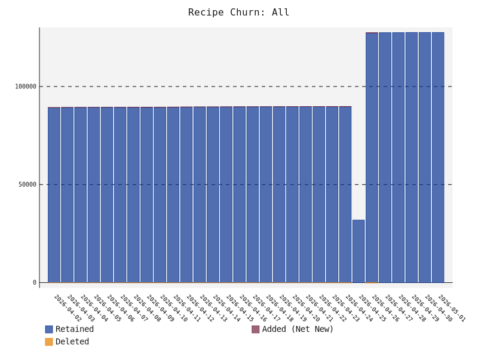
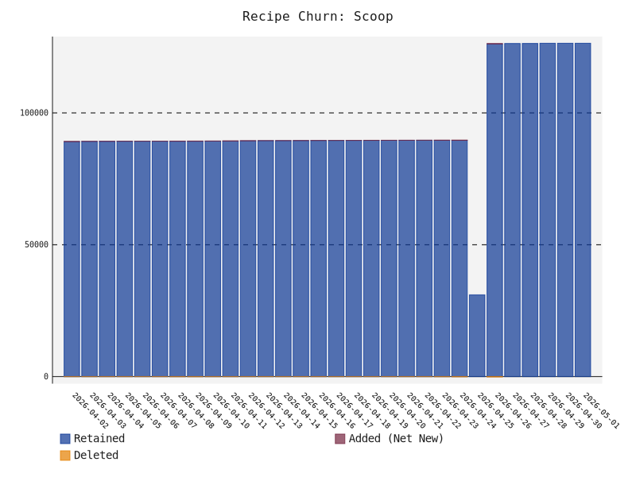
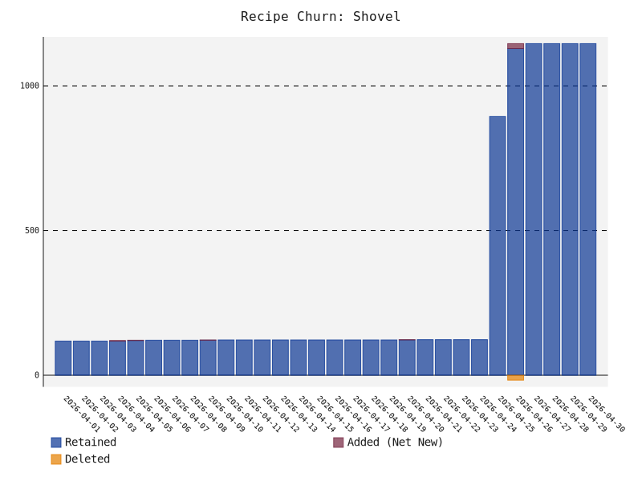

# Scoop Shovel Radar
A data-driven, automated discovery and ranking engine for the Scoop Shovel package manager ecosystem on Windows

# Build Status


# 📊 Ecosystem Health
* **Total Unique Recipes**: 25404
* **Ecosystem Auto-Update Health**: 86.2%
* **Ecosystem Reliability**: 89.6% (Sampled URL Health)
* **Official vs. Community**: 31588 Official / 51968 Community
* **Bucket Ecosystem**: 106 Scoop / 7 Shovel
* **Stale/Abandoned Sources (> 1 Year)**: 🪦 18

### Ecosystem Growth (All Recipes)
<picture>
  <source media="(prefers-color-scheme: dark)" srcset="growth_all_dark.svg">
  <source media="(prefers-color-scheme: light)" srcset="growth_all_light.svg">
  
</picture>


### Scoop vs Shovel Growth
<p align="center">
  <picture>
    <source media="(prefers-color-scheme: dark)" srcset="growth_scoop_dark.svg">
    <source media="(prefers-color-scheme: light)" srcset="growth_scoop_light.svg">
    
  </picture>
  <picture>
    <source media="(prefers-color-scheme: dark)" srcset="growth_shovel_dark.svg">
    <source media="(prefers-color-scheme: light)" srcset="growth_shovel_light.svg">
    
  </picture>
</p>


# 🚀 Getting Started
To add and use any of the repositories listed below, run the appropriate command for your package manager:


```powershell
scoop bucket add <bucket-name> <bucket-url>
scoop install <bucket-name>/<app-name>
```


# Third party repositories by popularity


## 💎 Hidden Gems
These repositories are actively maintained and feature a high percentage of **unique** applications not found in official repositories. Great for discovering niche tools!

| Repository | Unique Recipes | Total Recipes | Score | Auto-Update |
| :--- | :---: | :---: | :---: | :---: |
| **[AntonOks/scoop-aoks](directory/AntonOks+scoop-aoks.md)** | 💎 241 (100.0%) | 📦 241 | ⭐ 1.0 | 🔄 99% |
| **[Scoopforge/Extras-Plus](directory/Scoopforge+Extras-Plus.md)** | 💎 45 (100.0%) | 📦 45 | ⭐ 1.0 | 🔄 100% |
| **[asimov-platform/scoop-bucket](directory/asimov-platform+scoop-bucket.md)** | 💎 33 (100.0%) | 📦 33 | ⭐ 1.0 | 🔄 100% |
| **[littleli/scoop-clojure](directory/littleli+scoop-clojure.md)** | 💎 27 (100.0%) | 📦 27 | ⭐ 1.0 | 🔄 100% |
| **[TheRandomLabs/Scoop-Python](directory/TheRandomLabs+Scoop-Python.md)** | 💎 25 (100.0%) | 📦 25 | ⭐ 1.0 | 🔄 100% |
| **[borger/scoop-galaxy-integrations](directory/borger+scoop-galaxy-integrations.md)** | 💎 21 (100.0%) | 📦 21 | ⭐ 1.0 | 🔄 100% |
| **[Rinkerbel/scooped](directory/Rinkerbel+scooped.md)** | 💎 20 (100.0%) | 📦 20 | ⭐ 1.0 | 🔄 100% |
| **[KnotUntied/scoop-fonts](directory/KnotUntied+scoop-fonts.md)** | 💎 160 (99.4%) | 📦 161 | ⭐ 1.0 | 🔄 67% |
| **[ACooper81/scoop-apps](directory/ACooper81+scoop-apps.md)** | 💎 151 (99.3%) | 📦 152 | ⭐ 1.0 | 🔄 94% |
| **[Scoopforge/Extras-CN](directory/Scoopforge+Extras-CN.md)** | 💎 89 (98.9%) | 📦 90 | ⭐ 1.0 | 🔄 97% |


## 🥄 Scoop Compatible Buckets
These buckets are fully compatible with Scoop (and Shovel). They contain standard JSON manifests.

<details>
<summary><b>Click to expand 106 Scoop buckets</b></summary>

| Repository | Recipes | Score | Auto-Update | Badges |
| :--- | :---: | :---: | :---: | :--- |
| **[anderlli0053/DEV-tools](directory/anderlli0053+DEV-tools.md)** | 📦 23621 | ⭐ 1.0 | 🔄 83% |  |
| **[cmontage/scoopbucket-third](directory/cmontage+scoopbucket-third.md)** | 📦 13738 | ⭐ 1.0 | 🔄 87% |  |
| **[kkzzhizhou/scoop-apps](directory/kkzzhizhou+scoop-apps.md)** | 📦 13531 | ⭐ 1.0 | 🔄 87% |  |
| **[lzwme/scoop-proxy-cn](directory/lzwme+scoop-proxy-cn.md)** | 📦 10673 | ⭐ 1.0 | 🔄 86% |  |
| **[duzyn/scoop-cn](directory/duzyn+scoop-cn.md)** | 📦 6337 | ⭐ 1.0 | 🔄 85% |  |
| **[hoilc/scoop-lemon](directory/hoilc+scoop-lemon.md)** | 📦 2520 | ⭐ 1.0 | 🔄 95% |  |
| **[ScoopInstaller/Extras](directory/ScoopInstaller+Extras.md)** | 📦 2300 | ⭐ 1.0 | 🔄 92% | 👑 Official Scoop<br>⭐ Known Shovel |
| **[ScoopInstaller/Main](directory/ScoopInstaller+Main.md)** | 📦 1506 | ⭐ 1.0 | 🔄 94% | 👑 Official Scoop<br>⭐ Known Shovel |
| **[DoveBoy/Apps](directory/DoveBoy+Apps.md)** | 📦 811 | ⭐ 1.0 | 🔄 100% |  |
| **[ScoopInstaller/Versions](directory/ScoopInstaller+Versions.md)** | 📦 571 | ⭐ 1.0 | 🔄 74% | 👑 Official Scoop<br>⭐ Known Shovel |
| **[Calinou/scoop-games](directory/Calinou+scoop-games.md)** | 📦 398 | ⭐ 1.0 | 🔄 92% | ⭐ Known Scoop<br>⭐ Known Shovel |
| **[ScoopInstaller/PHP](directory/ScoopInstaller+PHP.md)** | 📦 391 | ⭐ 1.0 | 🔄 4% | 👑 Official Scoop<br>⭐ Known Shovel |
| **[matthewjberger/scoop-nerd-fonts](directory/matthewjberger+scoop-nerd-fonts.md)** | 📦 366 | ⭐ 1.0 | 🔄 92% | ⭐ Known Scoop<br>⭐ Known Shovel |
| **[xrgzs/sdoog](directory/xrgzs+sdoog.md)** | 📦 342 | ⭐ 1.0 | 🔄 93% |  |
| **[ScoopInstaller/Java](directory/ScoopInstaller+Java.md)** | 📦 329 | ⭐ 1.0 | 🔄 86% | 👑 Official Scoop<br>⭐ Known Shovel |
| **[akirco/aki-apps](directory/akirco+aki-apps.md)** | 📦 302 | ⭐ 1.0 | 🔄 86% |  |
| **[ScoopInstaller/Nirsoft](directory/ScoopInstaller+Nirsoft.md)** | 📦 290 | ⭐ 1.0 | 🔄 100% | 👑 Official Scoop |
| **[chawyehsu/dorado](directory/chawyehsu+dorado.md)** | 📦 271 | ⭐ 1.0 | 🔄 94% |  |
| **[arch3rPro/PST-Bucket](directory/arch3rPro+PST-Bucket.md)** | 📦 260 | ⭐ 1.0 | 🔄 93% |  |
| **[AntonOks/scoop-aoks](directory/AntonOks+scoop-aoks.md)** | 📦 241 | ⭐ 1.0 | 🔄 99% |  |
| **[aliesbelik/poldi](directory/aliesbelik+poldi.md)** | 📦 220 | ⭐ 1.0 | 🔄 100% |  |
| **[brian6932/dank-scoop](directory/brian6932+dank-scoop.md)** | 📦 182 | ⭐ 1.0 | 🔄 97% |  |
| **[KnotUntied/scoop-fonts](directory/KnotUntied+scoop-fonts.md)** | 📦 161 | ⭐ 1.0 | 🔄 67% |  |
| **[hu3rror/scoop-muggle](directory/hu3rror+scoop-muggle.md)** | 📦 164 | ⭐ 1.0 | 🔄 82% |  |
| **[ACooper81/scoop-apps](directory/ACooper81+scoop-apps.md)** | 📦 152 | ⭐ 1.0 | 🔄 94% |  |
| **[ViCrack/scoop-bucket](directory/ViCrack+scoop-bucket.md)** | 📦 148 | ⭐ 1.0 | 🔄 99% |  |
| **[batkiz/backit](directory/batkiz+backit.md)** | 📦 146 | ⭐ 1.0 | 🔄 99% |  |
| **[abgox/abgo_bucket](directory/abgox+abgo_bucket.md)** | 📦 166 | ⭐ 1.0 | 🔄 99% |  |
| **[ScoopInstaller/Nonportable](directory/ScoopInstaller+Nonportable.md)** | 📦 131 | ⭐ 1.0 | 🔄 88% | 👑 Official Scoop |
| **[tldrw/scoop-security](directory/tldrw+scoop-security.md)** | 📦 119 | ⭐ 1.0 | 🔄 97% |  |
| **[amorphobia/siku](directory/amorphobia+siku.md)** | 📦 100 | ⭐ 1.0 | 🔄 95% |  |
| **[HUMORCE/nuke](directory/HUMORCE+nuke.md)** | 📦 90 | ⭐ 1.0 | 🔄 79% |  |
| **[Scoopforge/Extras-CN](directory/Scoopforge+Extras-CN.md)** | 📦 90 | ⭐ 1.0 | 🔄 97% |  |
| **[rasa/scoops](directory/rasa+scoops.md)** | 📦 78 | ⭐ 1.0 | 🔄 71% |  |
| **[babo4d/scoop-xrtools](directory/babo4d+scoop-xrtools.md)** | 📦 78 | ⭐ 1.0 | 🔄 95% |  |
| **[kengwang/scoop-ctftools-bucket](directory/kengwang+scoop-ctftools-bucket.md)** | 📦 77 | ⭐ 1.0 | 🔄 99% |  |
| **[404NetworkError/scoop-bucket](directory/404NetworkError+scoop-bucket.md)** | 📦 81 | ⭐ 1.0 | 🔄 96% |  |
| **[niheaven/scoop-sysinternals](directory/niheaven+scoop-sysinternals.md)** | 📦 75 | ⭐ 1.0 | 🔄 100% | ⭐ Known Scoop |
| **[TheRandomLabs/scoop-nonportable](directory/TheRandomLabs+scoop-nonportable.md)** | 📦 73 | ⭐ 1.0 | 🔄 86% | <br>⭐ Known Shovel |
| **[cc713/ownscoop](directory/cc713+ownscoop.md)** | 📦 76 | ⭐ 1.0 | 🔄 100% |  |
| **[hymkor/scoop-bucket](directory/hymkor+scoop-bucket.md)** | 📦 58 | ⭐ 1.0 | 🔄 100% |  |
| **[Velgus/Scoop-Portapps](directory/Velgus+Scoop-Portapps.md)** | 📦 61 | ⭐ 1.0 | 🔄 100% |  |
| **[cderv/r-bucket](directory/cderv+r-bucket.md)** | 📦 54 | ⭐ 1.0 | 🔄 94% |  |
| **[zhoujin7/tomato](directory/zhoujin7+tomato.md)** | 📦 52 | ⭐ 1.0 | 🔄 85% |  |
| **[milnak/scoop-bucket](directory/milnak+scoop-bucket.md)** | 📦 52 | ⭐ 1.0 | 🔄 98% |  |
| **[beer-psi/scoop-bucket](directory/beer-psi+scoop-bucket.md)** | 📦 51 | ⭐ 1.0 | 🔄 80% |  |
| **[windedge/ladle-bucket](directory/windedge+ladle-bucket.md)** | 📦 49 | ⭐ 1.0 | 🔄 100% |  |
| **[seumsc/scoop-seu](directory/seumsc+scoop-seu.md)** | 📦 57 | ⭐ 1.0 | 🔄 95% |  |
| **[jonz94/scoop-sarasa-nerd-fonts](directory/jonz94+scoop-sarasa-nerd-fonts.md)** | 📦 49 | ⭐ 1.0 | 🔄 100% |  |
| **[Scoopforge/Extras-Plus](directory/Scoopforge+Extras-Plus.md)** | 📦 45 | ⭐ 1.0 | 🔄 100% |  |
| **[p8rdev/scoop-portableapps](directory/p8rdev+scoop-portableapps.md)** | 📦 440 | ⭐ 1.0 | 🔄 100% |  |
| **[Locietta/sniffer](directory/Locietta+sniffer.md)** | 📦 42 | ⭐ 1.0 | 🔄 100% |  |
| **[Paxxs/Cluttered-bucket](directory/Paxxs+Cluttered-bucket.md)** | 📦 46 | ⭐ 1.0 | 🔄 91% |  |
| **[TianXiaTech/scoop-txt](directory/TianXiaTech+scoop-txt.md)** | 📦 40 | ⭐ 1.0 | 🔄 90% |  |
| **[iquiw/scoop-bucket](directory/iquiw+scoop-bucket.md)** | 📦 35 | ⭐ 1.0 | 🔄 100% |  |
| **[kkzzhizhou/scoop-zapps](directory/kkzzhizhou+scoop-zapps.md)** | 📦 34 | ⭐ 1.0 | 🔄 94% |  |
| **[AkariiinMKII/Scoop4kariiin](directory/AkariiinMKII+Scoop4kariiin.md)** | 📦 33 | ⭐ 1.0 | 🔄 73% |  |
| **[natecohen/scoop-av](directory/natecohen+scoop-av.md)** | 📦 33 | ⭐ 1.0 | 🔄 79% |  |
| **[asimov-platform/scoop-bucket](directory/asimov-platform+scoop-bucket.md)** | 📦 33 | ⭐ 1.0 | 🔄 100% |  |
| **[Scoopforge/Main-Plus](directory/Scoopforge+Main-Plus.md)** | 📦 31 | ⭐ 1.0 | 🔄 100% |  |
| **[wzv5/ScoopBucket](directory/wzv5+ScoopBucket.md)** | 📦 34 | ⭐ 1.0 | 🔄 97% |  |
| **[jfut/scoop-jfut](directory/jfut+scoop-jfut.md)** | 📦 33 | ⭐ 1.0 | 🔄 94% |  |
| **[noql-net/scoop](directory/noql-net+scoop.md)** | 📦 28 | ⭐ 1.0 | 🔄 100% |  |
| **[TheRandomLabs/Scoop-Python](directory/TheRandomLabs+Scoop-Python.md)** | 📦 25 | ⭐ 1.0 | 🔄 100% |  |
| **[NSIS-Dev/scoop-nsis](directory/NSIS-Dev+scoop-nsis.md)** | 📦 70 | ⭐ 1.0 | 🔄 100% |  |
| **[younger-1/scoop-it](directory/younger-1+scoop-it.md)** | 📦 24 | ⭐ 1.0 | 🔄 92% |  |
| **[se35710/scoop-redhat](directory/se35710+scoop-redhat.md)** | 📦 22 | ⭐ 1.0 | 🔄 100% |  |
| **[borger/scoop-galaxy-integrations](directory/borger+scoop-galaxy-integrations.md)** | 📦 21 | ⭐ 1.0 | 🔄 100% |  |
| **[Rinkerbel/scooped](directory/Rinkerbel+scooped.md)** | 📦 20 | ⭐ 1.0 | 🔄 100% |  |
| **[bobo2334/scoop-bucket](directory/bobo2334+scoop-bucket.md)** | 📦 19 | ⭐ 1.0 | 🔄 95% |  |
| **[TheCjw/scoop-retools](directory/TheCjw+scoop-retools.md)** | 📦 19 | ⭐ 1.0 | 🔄 79% |  |
| **[typst-community/scoop-bucket](directory/typst-community+scoop-bucket.md)** | 📦 17 | ⭐ 1.0 | 🔄 100% |  |
| **[TheRandomLabs/Scoop-Spotify](directory/TheRandomLabs+Scoop-Spotify.md)** | 📦 10 | ⭐ 1.0 | 🔄 90% |  |
| **[EFLKumo/jam](directory/EFLKumo+jam.md)** | 📦 10 | ⭐ 1.0 | 🔄 100% |  |
| **[tetradice/scoop-iyokan-jp](directory/tetradice+scoop-iyokan-jp.md)** | 📦 13 | ⭐ 1.0 | 🔄 100% |  |
| **[goreleaser/scoop-bucket](directory/goreleaser+scoop-bucket.md)** | 📦 4 | ⭐ 1.0 | 🔄 0% |  |
| **[yuanying1199/scoopbucket](directory/yuanying1199+scoopbucket.md)** | 📦 29 | ⭐ 1.0 | 🔄 86% |  |
| **[enndubyu/scoop-zig](directory/enndubyu+scoop-zig.md)** | 📦 4 | ⭐ 1.0 | 🔄 100% |  |
| **[tree-s/vsbuildtools](directory/tree-s+vsbuildtools.md)** | 📦 3 | ⭐ 1.0 | 🔄 100% |  |
| **[snyk/scoop-snyk](directory/snyk+scoop-snyk.md)** | 📦 2 | ⭐ 1.0 | 🔄 0% |  |
| **[idleberg/scoop-playdate-sdk](directory/idleberg+scoop-playdate-sdk.md)** | 📦 2 | ⭐ 1.0 | 🔄 100% |  |
| **[tod-org/tod](directory/tod-org+tod.md)** | 📦 1 | ⭐ 1.0 | 🔄 0% |  |
| **[LSchallot/JellyRoller](directory/LSchallot+JellyRoller.md)** | 📦 1 | ⭐ 1.0 | 🔄 100% |  |
| **[exoscale/cli](directory/exoscale+cli.md)** | 📦 1 | ⭐ 1.0 | 🔄 0% |  |
| **[meshery/scoop-bucket](directory/meshery+scoop-bucket.md)** | 📦 1 | ⭐ 1.0 | 🔄 0% |  |
| **[twpayne/scoop-bucket](directory/twpayne+scoop-bucket.md)** | 📦 1 | ⭐ 1.0 | 🔄 0% |  |
| **[BenjaminMichaelis/Config](directory/BenjaminMichaelis+Config.md)** | 📦 1 | ⭐ 1.0 | 🔄 100% |  |
| **[Aetopia/scoop-webview2](directory/Aetopia+scoop-webview2.md)** | 📦 1 | ⭐ 1.0 | 🔄 0% |  |
| **[configcat/scoop-configcat](directory/configcat+scoop-configcat.md)** | 📦 1 | ⭐ 1.0 | 🔄 100% |  |
| **[Ast3risk-ops/spotx-bucket](directory/Ast3risk-ops+spotx-bucket.md)** | 📦 1 | ⭐ 1.0 | 🔄 100% |  |
| **[Qv2ray/mochi](directory/Qv2ray+mochi.md)** | 📦 15 | ⭐ 1.0 | 🔄 53% |  |
| **[lumen-oss/rocks-scoop](directory/lumen-oss+rocks-scoop.md)** | 📦 2 | ⭐ 1.0 | 🔄 50% |  |
| **[jingyu9575/scoop-jingyu9575](directory/jingyu9575+scoop-jingyu9575.md)** | 📦 46 | ⭐ 1.0 | 🔄 74% |  |
| **[42wim/scoop-bucket](directory/42wim+scoop-bucket.md)** | 📦 13 | ⭐ 1.0 | 🔄 85% |  |
| **[AkinoKaede/maple](directory/AkinoKaede+maple.md)** | 📦 20 | ⭐ 1.0 | 🔄 100% |  |
| **[so1ve/destiny](directory/so1ve+destiny.md)** | 📦 8 | ⭐ 1.0 | 🔄 100% |  |
| **[WiiDatabase/scoop-bucket](directory/WiiDatabase+scoop-bucket.md)** | 📦 64 | ⭐ 1.0 | 🔄 80% |  |
| **[MCOfficer/scoop-bucket](directory/MCOfficer+scoop-bucket.md)** | 📦 53 | ⭐ 1.0 | 🔄 98% |  |
| **[KNOXDEV/wsl](directory/KNOXDEV+wsl.md)** | 📦 12 | ⭐ 1.0 | 🔄 25% |  |
| **[TheRandomLabs/Scoop-Bucket](directory/TheRandomLabs+Scoop-Bucket.md)** | 📦 13 | ⭐ 1.0 | 🔄 85% |  |
| **[ChungZH/peach](directory/ChungZH+peach.md)** | 📦 16 | ⭐ 1.0 | 🔄 94% |  |
| **[FDUZS/spoon](directory/FDUZS+spoon.md)** | 📦 42 | ⭐ 1.0 | 🔄 98% |  |
| **[mogeko/scoop-sysinternals](directory/mogeko+scoop-sysinternals.md)** | 📦 75 | ⭐ 1.0 | 🔄 100% |  |
| **[lptstr/lptstr-scoop](directory/lptstr+lptstr-scoop.md)** | 📦 3 | ⭐ 1.0 | 🔄 100% |  |
| **[rkbk60/scoop-for-jp](directory/rkbk60+scoop-for-jp.md)** | 📦 7 | ⭐ 1.0 | 🔄 100% |  |
| **[krproject/qi-windows](directory/krproject+qi-windows.md)** | 📦 14 | ⭐ 1.0 | 🔄 100% |  |

</details>

## ⛏️ Shovel Specific Buckets
These buckets utilize Shovel-specific features (like native YAML manifests) or are explicitly tagged for Shovel. They may not work with standard Scoop.

<details>
<summary><b>Click to expand 7 Shovel buckets</b></summary>

| Repository | Recipes | Score | Auto-Update | Badges |
| :--- | :---: | :---: | :---: | :--- |
| **[starise/Scoop-Confetti](directory/starise+Scoop-Confetti.md)** | 📦 54 | ⭐ 1.0 | 🔄 96% |  |
| **[Small-Ku/turbo-bucket](directory/Small-Ku+turbo-bucket.md)** | 📦 49 | ⭐ 1.0 | 🔄 96% |  |
| **[littleli/Scoop-littleli](directory/littleli+Scoop-littleli.md)** | 📦 45 | ⭐ 1.0 | 🔄 100% |  |
| **[Darkatse/Scoop-Darkatse](directory/Darkatse+Scoop-Darkatse.md)** | 📦 32 | ⭐ 1.0 | 🔄 97% |  |
| **[littleli/scoop-clojure](directory/littleli+scoop-clojure.md)** | 📦 27 | ⭐ 1.0 | 🔄 100% |  |
| **[littleli/Scoop-AtariEmulators](directory/littleli+Scoop-AtariEmulators.md)** | 📦 19 | ⭐ 1.0 | 🔄 95% |  |
| **[Darkatse/Scoop-KanColle](directory/Darkatse+Scoop-KanColle.md)** | 📦 9 | ⭐ 1.0 | 🔄 100% |  |

</details>


## 📦 All Known Sources
A combined list of every source discovered in the ecosystem.

<details>
<summary><b>Click to expand all 113 discovered sources</b></summary>

| Repository | Recipes | Score | Auto-Update | Badges |
| :--- | :---: | :---: | :---: | :--- |
| **[anderlli0053/DEV-tools](directory/anderlli0053+DEV-tools.md)** | 📦 23621 | ⭐ 1.0 | 🔄 83% |  |
| **[cmontage/scoopbucket-third](directory/cmontage+scoopbucket-third.md)** | 📦 13738 | ⭐ 1.0 | 🔄 87% |  |
| **[kkzzhizhou/scoop-apps](directory/kkzzhizhou+scoop-apps.md)** | 📦 13531 | ⭐ 1.0 | 🔄 87% |  |
| **[lzwme/scoop-proxy-cn](directory/lzwme+scoop-proxy-cn.md)** | 📦 10673 | ⭐ 1.0 | 🔄 86% |  |
| **[duzyn/scoop-cn](directory/duzyn+scoop-cn.md)** | 📦 6337 | ⭐ 1.0 | 🔄 85% |  |
| **[hoilc/scoop-lemon](directory/hoilc+scoop-lemon.md)** | 📦 2520 | ⭐ 1.0 | 🔄 95% |  |
| **[ScoopInstaller/Extras](directory/ScoopInstaller+Extras.md)** | 📦 2300 | ⭐ 1.0 | 🔄 92% | 👑 Official Scoop<br>⭐ Known Shovel |
| **[ScoopInstaller/Main](directory/ScoopInstaller+Main.md)** | 📦 1506 | ⭐ 1.0 | 🔄 94% | 👑 Official Scoop<br>⭐ Known Shovel |
| **[DoveBoy/Apps](directory/DoveBoy+Apps.md)** | 📦 811 | ⭐ 1.0 | 🔄 100% |  |
| **[ScoopInstaller/Versions](directory/ScoopInstaller+Versions.md)** | 📦 571 | ⭐ 1.0 | 🔄 74% | 👑 Official Scoop<br>⭐ Known Shovel |
| **[Calinou/scoop-games](directory/Calinou+scoop-games.md)** | 📦 398 | ⭐ 1.0 | 🔄 92% | ⭐ Known Scoop<br>⭐ Known Shovel |
| **[ScoopInstaller/PHP](directory/ScoopInstaller+PHP.md)** | 📦 391 | ⭐ 1.0 | 🔄 4% | 👑 Official Scoop<br>⭐ Known Shovel |
| **[matthewjberger/scoop-nerd-fonts](directory/matthewjberger+scoop-nerd-fonts.md)** | 📦 366 | ⭐ 1.0 | 🔄 92% | ⭐ Known Scoop<br>⭐ Known Shovel |
| **[xrgzs/sdoog](directory/xrgzs+sdoog.md)** | 📦 342 | ⭐ 1.0 | 🔄 93% |  |
| **[ScoopInstaller/Java](directory/ScoopInstaller+Java.md)** | 📦 329 | ⭐ 1.0 | 🔄 86% | 👑 Official Scoop<br>⭐ Known Shovel |
| **[akirco/aki-apps](directory/akirco+aki-apps.md)** | 📦 302 | ⭐ 1.0 | 🔄 86% |  |
| **[ScoopInstaller/Nirsoft](directory/ScoopInstaller+Nirsoft.md)** | 📦 290 | ⭐ 1.0 | 🔄 100% | 👑 Official Scoop |
| **[chawyehsu/dorado](directory/chawyehsu+dorado.md)** | 📦 271 | ⭐ 1.0 | 🔄 94% |  |
| **[arch3rPro/PST-Bucket](directory/arch3rPro+PST-Bucket.md)** | 📦 260 | ⭐ 1.0 | 🔄 93% |  |
| **[AntonOks/scoop-aoks](directory/AntonOks+scoop-aoks.md)** | 📦 241 | ⭐ 1.0 | 🔄 99% |  |
| **[aliesbelik/poldi](directory/aliesbelik+poldi.md)** | 📦 220 | ⭐ 1.0 | 🔄 100% |  |
| **[brian6932/dank-scoop](directory/brian6932+dank-scoop.md)** | 📦 182 | ⭐ 1.0 | 🔄 97% |  |
| **[KnotUntied/scoop-fonts](directory/KnotUntied+scoop-fonts.md)** | 📦 161 | ⭐ 1.0 | 🔄 67% |  |
| **[hu3rror/scoop-muggle](directory/hu3rror+scoop-muggle.md)** | 📦 164 | ⭐ 1.0 | 🔄 82% |  |
| **[ACooper81/scoop-apps](directory/ACooper81+scoop-apps.md)** | 📦 152 | ⭐ 1.0 | 🔄 94% |  |
| **[ViCrack/scoop-bucket](directory/ViCrack+scoop-bucket.md)** | 📦 148 | ⭐ 1.0 | 🔄 99% |  |
| **[batkiz/backit](directory/batkiz+backit.md)** | 📦 146 | ⭐ 1.0 | 🔄 99% |  |
| **[abgox/abgo_bucket](directory/abgox+abgo_bucket.md)** | 📦 166 | ⭐ 1.0 | 🔄 99% |  |
| **[ScoopInstaller/Nonportable](directory/ScoopInstaller+Nonportable.md)** | 📦 131 | ⭐ 1.0 | 🔄 88% | 👑 Official Scoop |
| **[tldrw/scoop-security](directory/tldrw+scoop-security.md)** | 📦 119 | ⭐ 1.0 | 🔄 97% |  |
| **[amorphobia/siku](directory/amorphobia+siku.md)** | 📦 100 | ⭐ 1.0 | 🔄 95% |  |
| **[HUMORCE/nuke](directory/HUMORCE+nuke.md)** | 📦 90 | ⭐ 1.0 | 🔄 79% |  |
| **[Scoopforge/Extras-CN](directory/Scoopforge+Extras-CN.md)** | 📦 90 | ⭐ 1.0 | 🔄 97% |  |
| **[rasa/scoops](directory/rasa+scoops.md)** | 📦 78 | ⭐ 1.0 | 🔄 71% |  |
| **[babo4d/scoop-xrtools](directory/babo4d+scoop-xrtools.md)** | 📦 78 | ⭐ 1.0 | 🔄 95% |  |
| **[kengwang/scoop-ctftools-bucket](directory/kengwang+scoop-ctftools-bucket.md)** | 📦 77 | ⭐ 1.0 | 🔄 99% |  |
| **[404NetworkError/scoop-bucket](directory/404NetworkError+scoop-bucket.md)** | 📦 81 | ⭐ 1.0 | 🔄 96% |  |
| **[niheaven/scoop-sysinternals](directory/niheaven+scoop-sysinternals.md)** | 📦 75 | ⭐ 1.0 | 🔄 100% | ⭐ Known Scoop |
| **[TheRandomLabs/scoop-nonportable](directory/TheRandomLabs+scoop-nonportable.md)** | 📦 73 | ⭐ 1.0 | 🔄 86% | <br>⭐ Known Shovel |
| **[cc713/ownscoop](directory/cc713+ownscoop.md)** | 📦 76 | ⭐ 1.0 | 🔄 100% |  |
| **[hymkor/scoop-bucket](directory/hymkor+scoop-bucket.md)** | 📦 58 | ⭐ 1.0 | 🔄 100% |  |
| **[Velgus/Scoop-Portapps](directory/Velgus+Scoop-Portapps.md)** | 📦 61 | ⭐ 1.0 | 🔄 100% |  |
| **[cderv/r-bucket](directory/cderv+r-bucket.md)** | 📦 54 | ⭐ 1.0 | 🔄 94% |  |
| **[starise/Scoop-Confetti](directory/starise+Scoop-Confetti.md)** | 📦 54 | ⭐ 1.0 | 🔄 96% |  |
| **[zhoujin7/tomato](directory/zhoujin7+tomato.md)** | 📦 52 | ⭐ 1.0 | 🔄 85% |  |
| **[milnak/scoop-bucket](directory/milnak+scoop-bucket.md)** | 📦 52 | ⭐ 1.0 | 🔄 98% |  |
| **[beer-psi/scoop-bucket](directory/beer-psi+scoop-bucket.md)** | 📦 51 | ⭐ 1.0 | 🔄 80% |  |
| **[Small-Ku/turbo-bucket](directory/Small-Ku+turbo-bucket.md)** | 📦 49 | ⭐ 1.0 | 🔄 96% |  |
| **[windedge/ladle-bucket](directory/windedge+ladle-bucket.md)** | 📦 49 | ⭐ 1.0 | 🔄 100% |  |
| **[seumsc/scoop-seu](directory/seumsc+scoop-seu.md)** | 📦 57 | ⭐ 1.0 | 🔄 95% |  |
| **[jonz94/scoop-sarasa-nerd-fonts](directory/jonz94+scoop-sarasa-nerd-fonts.md)** | 📦 49 | ⭐ 1.0 | 🔄 100% |  |
| **[Scoopforge/Extras-Plus](directory/Scoopforge+Extras-Plus.md)** | 📦 45 | ⭐ 1.0 | 🔄 100% |  |
| **[littleli/Scoop-littleli](directory/littleli+Scoop-littleli.md)** | 📦 45 | ⭐ 1.0 | 🔄 100% |  |
| **[p8rdev/scoop-portableapps](directory/p8rdev+scoop-portableapps.md)** | 📦 440 | ⭐ 1.0 | 🔄 100% |  |
| **[Locietta/sniffer](directory/Locietta+sniffer.md)** | 📦 42 | ⭐ 1.0 | 🔄 100% |  |
| **[Paxxs/Cluttered-bucket](directory/Paxxs+Cluttered-bucket.md)** | 📦 46 | ⭐ 1.0 | 🔄 91% |  |
| **[TianXiaTech/scoop-txt](directory/TianXiaTech+scoop-txt.md)** | 📦 40 | ⭐ 1.0 | 🔄 90% |  |
| **[iquiw/scoop-bucket](directory/iquiw+scoop-bucket.md)** | 📦 35 | ⭐ 1.0 | 🔄 100% |  |
| **[kkzzhizhou/scoop-zapps](directory/kkzzhizhou+scoop-zapps.md)** | 📦 34 | ⭐ 1.0 | 🔄 94% |  |
| **[AkariiinMKII/Scoop4kariiin](directory/AkariiinMKII+Scoop4kariiin.md)** | 📦 33 | ⭐ 1.0 | 🔄 73% |  |
| **[natecohen/scoop-av](directory/natecohen+scoop-av.md)** | 📦 33 | ⭐ 1.0 | 🔄 79% |  |
| **[asimov-platform/scoop-bucket](directory/asimov-platform+scoop-bucket.md)** | 📦 33 | ⭐ 1.0 | 🔄 100% |  |
| **[Darkatse/Scoop-Darkatse](directory/Darkatse+Scoop-Darkatse.md)** | 📦 32 | ⭐ 1.0 | 🔄 97% |  |
| **[Scoopforge/Main-Plus](directory/Scoopforge+Main-Plus.md)** | 📦 31 | ⭐ 1.0 | 🔄 100% |  |
| **[wzv5/ScoopBucket](directory/wzv5+ScoopBucket.md)** | 📦 34 | ⭐ 1.0 | 🔄 97% |  |
| **[jfut/scoop-jfut](directory/jfut+scoop-jfut.md)** | 📦 33 | ⭐ 1.0 | 🔄 94% |  |
| **[noql-net/scoop](directory/noql-net+scoop.md)** | 📦 28 | ⭐ 1.0 | 🔄 100% |  |
| **[littleli/scoop-clojure](directory/littleli+scoop-clojure.md)** | 📦 27 | ⭐ 1.0 | 🔄 100% |  |
| **[TheRandomLabs/Scoop-Python](directory/TheRandomLabs+Scoop-Python.md)** | 📦 25 | ⭐ 1.0 | 🔄 100% |  |
| **[NSIS-Dev/scoop-nsis](directory/NSIS-Dev+scoop-nsis.md)** | 📦 70 | ⭐ 1.0 | 🔄 100% |  |
| **[younger-1/scoop-it](directory/younger-1+scoop-it.md)** | 📦 24 | ⭐ 1.0 | 🔄 92% |  |
| **[se35710/scoop-redhat](directory/se35710+scoop-redhat.md)** | 📦 22 | ⭐ 1.0 | 🔄 100% |  |
| **[borger/scoop-galaxy-integrations](directory/borger+scoop-galaxy-integrations.md)** | 📦 21 | ⭐ 1.0 | 🔄 100% |  |
| **[Rinkerbel/scooped](directory/Rinkerbel+scooped.md)** | 📦 20 | ⭐ 1.0 | 🔄 100% |  |
| **[bobo2334/scoop-bucket](directory/bobo2334+scoop-bucket.md)** | 📦 19 | ⭐ 1.0 | 🔄 95% |  |
| **[TheCjw/scoop-retools](directory/TheCjw+scoop-retools.md)** | 📦 19 | ⭐ 1.0 | 🔄 79% |  |
| **[typst-community/scoop-bucket](directory/typst-community+scoop-bucket.md)** | 📦 17 | ⭐ 1.0 | 🔄 100% |  |
| **[littleli/Scoop-AtariEmulators](directory/littleli+Scoop-AtariEmulators.md)** | 📦 19 | ⭐ 1.0 | 🔄 95% |  |
| **[TheRandomLabs/Scoop-Spotify](directory/TheRandomLabs+Scoop-Spotify.md)** | 📦 10 | ⭐ 1.0 | 🔄 90% |  |
| **[EFLKumo/jam](directory/EFLKumo+jam.md)** | 📦 10 | ⭐ 1.0 | 🔄 100% |  |
| **[tetradice/scoop-iyokan-jp](directory/tetradice+scoop-iyokan-jp.md)** | 📦 13 | ⭐ 1.0 | 🔄 100% |  |
| **[goreleaser/scoop-bucket](directory/goreleaser+scoop-bucket.md)** | 📦 4 | ⭐ 1.0 | 🔄 0% |  |
| **[yuanying1199/scoopbucket](directory/yuanying1199+scoopbucket.md)** | 📦 29 | ⭐ 1.0 | 🔄 86% |  |
| **[enndubyu/scoop-zig](directory/enndubyu+scoop-zig.md)** | 📦 4 | ⭐ 1.0 | 🔄 100% |  |
| **[tree-s/vsbuildtools](directory/tree-s+vsbuildtools.md)** | 📦 3 | ⭐ 1.0 | 🔄 100% |  |
| **[snyk/scoop-snyk](directory/snyk+scoop-snyk.md)** | 📦 2 | ⭐ 1.0 | 🔄 0% |  |
| **[idleberg/scoop-playdate-sdk](directory/idleberg+scoop-playdate-sdk.md)** | 📦 2 | ⭐ 1.0 | 🔄 100% |  |
| **[tod-org/tod](directory/tod-org+tod.md)** | 📦 1 | ⭐ 1.0 | 🔄 0% |  |
| **[LSchallot/JellyRoller](directory/LSchallot+JellyRoller.md)** | 📦 1 | ⭐ 1.0 | 🔄 100% |  |
| **[exoscale/cli](directory/exoscale+cli.md)** | 📦 1 | ⭐ 1.0 | 🔄 0% |  |
| **[meshery/scoop-bucket](directory/meshery+scoop-bucket.md)** | 📦 1 | ⭐ 1.0 | 🔄 0% |  |
| **[twpayne/scoop-bucket](directory/twpayne+scoop-bucket.md)** | 📦 1 | ⭐ 1.0 | 🔄 0% |  |
| **[BenjaminMichaelis/Config](directory/BenjaminMichaelis+Config.md)** | 📦 1 | ⭐ 1.0 | 🔄 100% |  |
| **[Aetopia/scoop-webview2](directory/Aetopia+scoop-webview2.md)** | 📦 1 | ⭐ 1.0 | 🔄 0% |  |
| **[configcat/scoop-configcat](directory/configcat+scoop-configcat.md)** | 📦 1 | ⭐ 1.0 | 🔄 100% |  |
| **[Ast3risk-ops/spotx-bucket](directory/Ast3risk-ops+spotx-bucket.md)** | 📦 1 | ⭐ 1.0 | 🔄 100% |  |
| **[Qv2ray/mochi](directory/Qv2ray+mochi.md)** | 📦 15 | ⭐ 1.0 | 🔄 53% |  |
| **[lumen-oss/rocks-scoop](directory/lumen-oss+rocks-scoop.md)** | 📦 2 | ⭐ 1.0 | 🔄 50% |  |
| **[jingyu9575/scoop-jingyu9575](directory/jingyu9575+scoop-jingyu9575.md)** | 📦 46 | ⭐ 1.0 | 🔄 74% |  |
| **[42wim/scoop-bucket](directory/42wim+scoop-bucket.md)** | 📦 13 | ⭐ 1.0 | 🔄 85% |  |
| **[Darkatse/Scoop-KanColle](directory/Darkatse+Scoop-KanColle.md)** | 📦 9 | ⭐ 1.0 | 🔄 100% |  |
| **[AkinoKaede/maple](directory/AkinoKaede+maple.md)** | 📦 20 | ⭐ 1.0 | 🔄 100% |  |
| **[so1ve/destiny](directory/so1ve+destiny.md)** | 📦 8 | ⭐ 1.0 | 🔄 100% |  |
| **[WiiDatabase/scoop-bucket](directory/WiiDatabase+scoop-bucket.md)** | 📦 64 | ⭐ 1.0 | 🔄 80% |  |
| **[MCOfficer/scoop-bucket](directory/MCOfficer+scoop-bucket.md)** | 📦 53 | ⭐ 1.0 | 🔄 98% |  |
| **[KNOXDEV/wsl](directory/KNOXDEV+wsl.md)** | 📦 12 | ⭐ 1.0 | 🔄 25% |  |
| **[TheRandomLabs/Scoop-Bucket](directory/TheRandomLabs+Scoop-Bucket.md)** | 📦 13 | ⭐ 1.0 | 🔄 85% |  |
| **[ChungZH/peach](directory/ChungZH+peach.md)** | 📦 16 | ⭐ 1.0 | 🔄 94% |  |
| **[FDUZS/spoon](directory/FDUZS+spoon.md)** | 📦 42 | ⭐ 1.0 | 🔄 98% |  |
| **[mogeko/scoop-sysinternals](directory/mogeko+scoop-sysinternals.md)** | 📦 75 | ⭐ 1.0 | 🔄 100% |  |
| **[lptstr/lptstr-scoop](directory/lptstr+lptstr-scoop.md)** | 📦 3 | ⭐ 1.0 | 🔄 100% |  |
| **[rkbk60/scoop-for-jp](directory/rkbk60+scoop-for-jp.md)** | 📦 7 | ⭐ 1.0 | 🔄 100% |  |
| **[krproject/qi-windows](directory/krproject+qi-windows.md)** | 📦 14 | ⭐ 1.0 | 🔄 100% |  |

</details>

# 🛠️ Operational Health (Crawler Metrics)
* **Total Crawler Runs**: 2
* **Total Repo Updates**: 120
* **Ecosystem Growth (Since Last Run)**:
  * 🪣 +59 Repositories
  * 📦 +3268 Recipes
* **Eviction Count**: 🗑️ 0
* **API Rate Limit Retries**: ⏳ 0
* **Cache Size**: 💾 5.89 MB
* **Pipeline Times (Last Run)**:
  * 🔍 Discovery: 2.56s
  * 📥 Update: 28.85s
* **Cumulative Compute Time**: 9.1 minutes