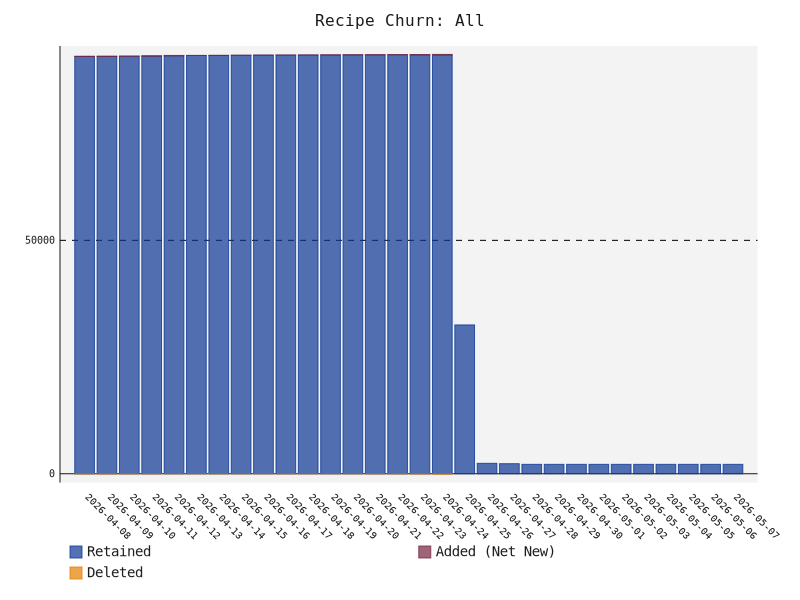

# scoop-radar
A data-driven, automated discovery and ranking engine for the Scoop package manager ecosystem on Windows

# Build Status


# Acknowledgements
This project was heavily inspired by the original `awesome-scoop` directories maintained by [algomaniac](https://github.com/algomaniac) and [tapannallan](https://github.com/tapannallan).

# 📊 Ecosystem Health
* **Total Unique Recipes**: 1569
* **Ecosystem Auto-Update Health**: 0.0%
* **Ecosystem Reliability**: 100.0% (Sampled URL Health)
* **Official vs. Community**: 5352 Official / 59 Community
* **Bucket Ecosystem**: 5 Scoop / 0 Shovel
* **Bucket Graveyard (Stale > 1 Year)**: 🪦 1

### Ecosystem Growth (All Recipes)
<picture>
  <source media="(prefers-color-scheme: dark)" srcset="growth_all_dark.svg">
  <source media="(prefers-color-scheme: light)" srcset="growth_all_light.svg">
  
</picture>

### Scoop vs Shovel Growth
<p align="center">
  <picture>
    <source media="(prefers-color-scheme: dark)" srcset="growth_scoop_dark.svg">
    <source media="(prefers-color-scheme: light)" srcset="growth_scoop_light.svg">
    
  </picture>
  <picture>
    <source media="(prefers-color-scheme: dark)" srcset="growth_shovel_dark.svg">
    <source media="(prefers-color-scheme: light)" srcset="growth_shovel_light.svg">
    
  </picture>
</p>

# 🚀 Getting Started
To add and use any of the buckets listed below, simply run the following command in your terminal:
```powershell
scoop bucket add <bucket-name> <bucket-url>
```
For example, to add a specific bucket, find its URL from the list below and run:
```powershell
scoop bucket add my-awesome-bucket https://github.com/user/my-awesome-bucket
```
After adding the bucket, you can install any of its applications like this:
```powershell
scoop install my-awesome-bucket/<app-name>
```

# Third party buckets by popularity


## 💎 Hidden Gems
These buckets are actively maintained and feature a high percentage of **unique** applications not found in official repositories. Great for discovering niche tools!

| Repository | Unique Recipes | Total Recipes | Score | Auto-Update |
| :--- | :---: | :---: | :---: | :---: |
| **[voicemeet/winget-updater](directory/voicemeet+winget-updater.md)** | 💎 26 (100.0%) | 📦 26 | ⭐ 1.0 | 🔄 0% |
| **[picguard/winget-updater](directory/picguard+winget-updater.md)** | 💎 16 (100.0%) | 📦 16 | ⭐ 1.0 | 🔄 0% |
| **[223n/winget-usacloud](directory/223n+winget-usacloud.md)** | 💎 8 (100.0%) | 📦 8 | ⭐ 1.0 | 🔄 0% |


## 🥄 Scoop Compatible Buckets
These buckets are fully compatible with Scoop (and Shovel). They contain standard JSON manifests.

<details>
<summary><b>Click to expand 5 Scoop buckets</b></summary>

| Repository | Recipes | Score | Auto-Update | Badges |
| :--- | :---: | :---: | :---: | :--- |
| **[microsoft/winget-pkgs-submission-test](directory/microsoft+winget-pkgs-submission-test.md)** | 📦 5352 | ⭐ 1.0 | 🔄 0% | 👑 Official Scoop |
| **[voicemeet/winget-updater](directory/voicemeet+winget-updater.md)** | 📦 26 | ⭐ 1.0 | 🔄 0% |  |
| **[picguard/winget-updater](directory/picguard+winget-updater.md)** | 📦 16 | ⭐ 1.0 | 🔄 0% |  |
| **[223n/winget-usacloud](directory/223n+winget-usacloud.md)** | 📦 8 | ⭐ 1.0 | 🔄 0% |  |
| **[RadikaRules/scripts](directory/RadikaRules+scripts.md)** | 📦 9 | ⭐ 1.0 | 🔄 0% |  |

</details>

## ⛏️ Shovel Specific Buckets
These buckets utilize Shovel-specific features (like native YAML manifests) or are explicitly tagged for Shovel. They may not work with standard Scoop.

<details>
<summary><b>Click to expand 0 Shovel buckets</b></summary>

| Repository | Recipes | Score | Auto-Update | Badges |
| :--- | :---: | :---: | :---: | :--- |

</details>

## 📦 All Known Buckets
A combined list of every bucket discovered in the ecosystem.

<details>
<summary><b>Click to expand all 5 discovered buckets</b></summary>

| Repository | Recipes | Score | Auto-Update | Badges |
| :--- | :---: | :---: | :---: | :--- |
| **[microsoft/winget-pkgs-submission-test](directory/microsoft+winget-pkgs-submission-test.md)** | 📦 5352 | ⭐ 1.0 | 🔄 0% | 👑 Official Scoop |
| **[voicemeet/winget-updater](directory/voicemeet+winget-updater.md)** | 📦 26 | ⭐ 1.0 | 🔄 0% |  |
| **[picguard/winget-updater](directory/picguard+winget-updater.md)** | 📦 16 | ⭐ 1.0 | 🔄 0% |  |
| **[223n/winget-usacloud](directory/223n+winget-usacloud.md)** | 📦 8 | ⭐ 1.0 | 🔄 0% |  |
| **[RadikaRules/scripts](directory/RadikaRules+scripts.md)** | 📦 9 | ⭐ 1.0 | 🔄 0% |  |

</details>

# 🛠️ Operational Health (Crawler Metrics)
* **Total Crawler Runs**: 1
* **Total Repo Updates**: 26
* **Ecosystem Growth (Since Last Run)**:
  * 🪣 +0 Buckets
  * 📦 +0 Recipes
* **Eviction Count**: 🗑️ 0
* **API Rate Limit Retries**: ⏳ 0
* **Cache Size**: 💾 0.39 MB
* **Pipeline Times (Last Run)**:
  * 🔍 Discovery: 0.78s
  * 📥 Update: 14.19s
* **Cumulative Compute Time**: 0.2 minutes
